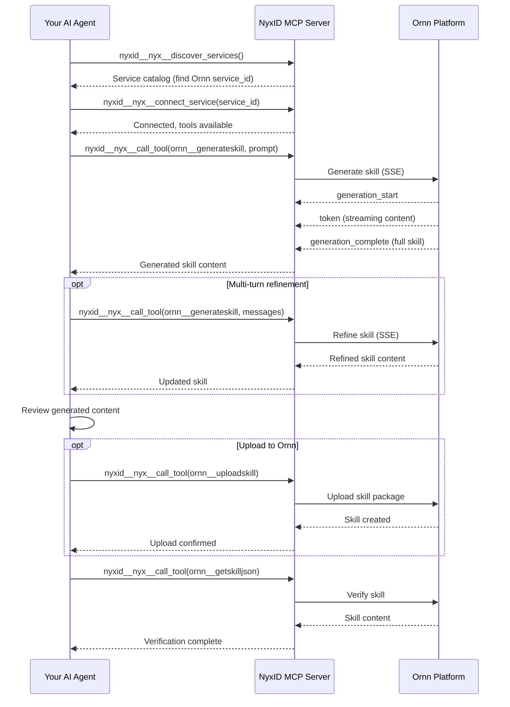

# Ornn Skill Generation Guide

## Overview

This skill teaches AI agents how to **create new skills** on the Ornn platform using AI-powered generation through the NyxID MCP server's meta tools. The `ornn__generateskill` tool takes a natural language description and produces a complete, valid skill package — including `SKILL.md` with proper frontmatter and any necessary scripts.

## Prerequisites

Your AI agent must be connected to the **NyxID MCP server**. NyxID MCP is the central gateway for all Chrono platform services.

## Step 1 — Connect to the Ornn Service

### 1.1 Discover the Ornn Service

Call `nyxid__nyx__discover_services` to find the Ornn service:

```json
// nyxid__nyx__discover_services result (abridged)
{
  "services": [
    {
      "service_id": "5a036016-b216-43e1-9c6f-f241f445607d",
      "name": "Ornn",
      "slug": "ornn",
      "category": "internal",
      "requires_credential": false
    }
  ]
}
```

### 1.2 Connect to Ornn

Call `nyxid__nyx__connect_service` with the Ornn `service_id`:

```json
{
  "service_id": "5a036016-b216-43e1-9c6f-f241f445607d"
}
```

Once connected, Ornn tools (including `ornn__generateskill`) become available.

## Step 2 — Generate a Skill (Single-Turn)

For straightforward skill requests, use the `prompt` parameter with a single natural language description.

Call `nyxid__nyx__call_tool` with `ornn__generateskill`:

```json
// nyxid__nyx__call_tool arguments
{
  "tool_name": "ornn__generateskill",
  "arguments_json": "{\"prompt\": \"Create a skill that takes a URL and generates a summary of the web page content using Node.js with the cheerio and axios libraries\"}"
}
```

### Parameters

| Parameter | Type | Description |
|-----------|------|-------------|
| `prompt` | string | Single-turn description of the skill to generate. **Mutually exclusive** with `messages` |
| `messages` | array | Multi-turn conversation history for iterative refinement. **Mutually exclusive** with `prompt` |
| `model` | string | LLM model to use (optional, uses platform default) |

### SSE Response Stream

The response is an **SSE (Server-Sent Events) stream** with the following event types:

| Event | Description |
|-------|-------------|
| `generation_start` | Generation has started |
| `token` | Incremental text output (skill content being generated) |
| `generation_complete` | Full generated skill content (final result) |
| `validation_error` | Generated content failed format validation |
| `error` | Generation error |

The `generation_complete` event contains the complete skill — a valid `SKILL.md` with frontmatter and any associated scripts.

## Step 3 — Generate a Skill (Multi-Turn Refinement)

For more complex skills or when you want to iteratively refine the output, use the `messages` parameter with a conversation history.

```json
// nyxid__nyx__call_tool arguments — initial generation
{
  "tool_name": "ornn__generateskill",
  "arguments_json": "{\"messages\": [{\"role\": \"user\", \"content\": \"Create a skill that generates marketing images from text prompts\"}]}"
}
```

After receiving the initial generation, refine it by appending to the conversation:

```json
// nyxid__nyx__call_tool arguments — refinement
{
  "tool_name": "ornn__generateskill",
  "arguments_json": "{\"messages\": [{\"role\": \"user\", \"content\": \"Create a skill that generates marketing images from text prompts\"}, {\"role\": \"assistant\", \"content\": \"<previous generation output>\"}, {\"role\": \"user\", \"content\": \"Add support for custom image dimensions and make it use the DALL-E 3 API instead\"}]}"
}
```

### When to Use Multi-Turn

- The initial generation needs adjustments (adding features, changing dependencies)
- You want to add error handling or edge case support
- The skill requirements are complex and benefit from iterative development
- You want to change the runtime, dependencies, or output type

## Step 4 — Review and Save the Generated Skill

After generation completes, the `generation_complete` event contains the full skill content. Review it for:

1. **Frontmatter correctness** — Verify `name`, `description`, `metadata.category`, and conditional fields
2. **Script quality** — Check that generated scripts are functional and follow best practices
3. **Environment variables** — Ensure any required env vars are declared in `metadata.runtime-env-var`
4. **Dependencies** — Verify `metadata.runtime-dependency` lists all required packages

### Saving the Skill

Once satisfied with the generated skill, you have two options:

#### Option A — Upload directly via `ornn__uploadskill`

Package the generated content into a ZIP and upload it:

```json
{
  "tool_name": "ornn__uploadskill",
  "arguments_json": "{\"skip_validation\": false}"
}
```

See the [ornn-upload](../ornn-upload/SKILL.md) guide for detailed upload instructions.

#### Option B — Save locally for further editing

Write the generated files to your local file system for manual review and modification before uploading.

## Step 5 — Verify the Generated Skill

After uploading, verify the skill exists and is correctly indexed:

```json
// nyxid__nyx__call_tool arguments
{
  "tool_name": "ornn__getskilljson",
  "arguments_json": "{\"idOrName\": \"<generated-skill-name>\"}"
}
```

This returns the full skill content so you can confirm everything was saved correctly.

## Complete Workflow Diagram



## Writing Effective Generation Prompts

### Good Prompts

- **Be specific about the runtime:** "Create a Node.js skill that..." or "Create a Python skill that..."
- **Mention dependencies:** "...using the cheerio and axios libraries"
- **Describe inputs and outputs:** "Takes a URL as input and returns a JSON summary"
- **Specify the output type:** "...that outputs a generated image file" (implies `output-type: file`)

### Examples

| Prompt | Result |
|--------|--------|
| "Create a skill that converts CSV data to JSON format using Node.js" | `runtime-based` skill with `node` runtime, `text` output |
| "Write a prompt engineering guide for writing effective marketing copy" | `plain` skill with comprehensive SKILL.md instructions |
| "Build a skill that generates charts from data using Python matplotlib and saves as PNG" | `runtime-based` skill with `python` runtime, `file` output, matplotlib dependency |
| "Create a skill that uses the GitHub MCP tool to analyze repository activity" | `tool-based` skill with GitHub tool in `tool-list` |

## Tips

- **Start simple, then refine** — Use single-turn `prompt` first. If the result needs tweaks, switch to multi-turn `messages`.
- **Specify the model** — If you need higher quality generation, pass a specific `model` parameter (e.g., a more capable LLM).
- **Handle validation errors** — If you receive a `validation_error` event, the generated skill has frontmatter issues. Use multi-turn refinement to fix them.
- **Combine with upload** — After successful generation, immediately upload the skill using `ornn__uploadskill` to make it available for search and execution.
- **Cross-reference format rules** — If generation fails validation, you can call `ornn__searchskills` or check the Ornn developer guide for the exact format specification.
