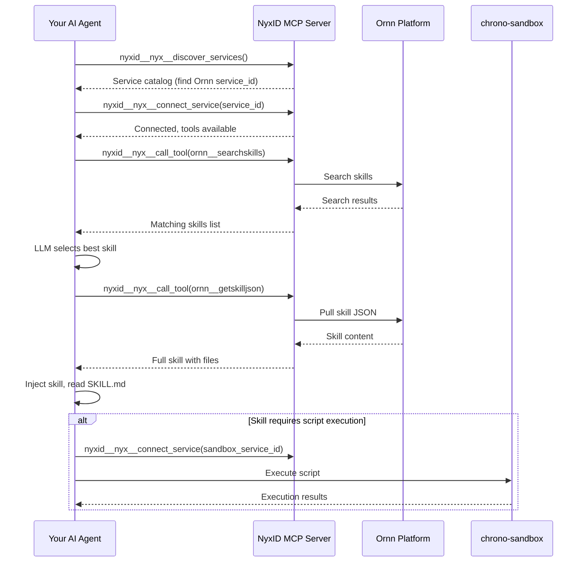

# Ornn Skill Search, Pull & Execute Guide

## Overview

This skill teaches AI agents how to **discover, pull, and execute** skills from the Ornn platform using the NyxID MCP server's meta tools. It covers the full lifecycle: service discovery → connection → skill search → skill pull → execution.

## Prerequisites

Your AI agent must be connected to the **NyxID MCP server**. NyxID MCP is the central gateway for all Chrono platform services — it handles authentication, authorization, and service routing.

## Step 1 — Discover the Ornn Service

Call `nyxid__nyx__discover_services` to see all services available through NyxID:

```json
// nyxid__nyx__discover_services result (abridged)
{
  "services": [
    {
      "service_id": "5a036016-b216-43e1-9c6f-f241f445607d",
      "name": "Ornn",
      "slug": "ornn",
      "description": "",
      "category": "internal",
      "requires_credential": false
    },
    {
      "service_id": "b6dac2eb-0b36-4514-b600-aeb4cf870cd6",
      "name": "Chrono Sandbox Service",
      "slug": "chrono-sandbox-service",
      "description": "",
      "category": "internal",
      "requires_credential": false
    }
  ],
  "count": 22
}
```

The two services relevant to skill execution are:

| Service | Slug | Purpose |
|---------|------|---------|
| **Ornn** | `ornn` | Skill search, pull, upload, and build |
| **Chrono Sandbox Service** | `chrono-sandbox-service` | Script execution for runtime-based skills |

## Step 2 — Connect to the Ornn Service

Call `nyxid__nyx__connect_service` with the Ornn service's `service_id`:

```json
// nyxid__nyx__connect_service arguments
{
  "service_id": "5a036016-b216-43e1-9c6f-f241f445607d"
}
```

Successful response:

```json
{
  "status": "connected",
  "service_name": "Ornn",
  "connected_at": "2026-03-16T08:21:46.590266623+00:00",
  "note": "Service tools are now available. Your tool list has been updated."
}
```

Once connected, Ornn tools appear in your agent's tool list. You only need to connect once per session.

> **Important:** If your skill requires script execution, also connect to `chrono-sandbox-service` using the same pattern.

## Step 3 — Browse Available Ornn Tools

Use `nyxid__nyx__search_tools` to discover the tools Ornn provides:

```json
// nyxid__nyx__search_tools arguments
{
  "query": "ornn"
}
```

This returns all Ornn tools with their names, descriptions, and input schemas:

| Tool | Description |
|------|-------------|
| `ornn__searchskills` | Search skills by keyword or semantic similarity |
| `ornn__getskill` | Get skill metadata by GUID or name (includes package download URL) |
| `ornn__getskilljson` | Get skill package as JSON with all file contents (preferred for agents) |
| `ornn__uploadskill` | Upload a ZIP-packaged skill to the registry |
| `ornn__generateskill` | Generate a skill via AI from natural language (SSE stream) |

## Step 4 — Search for Skills

Use `nyxid__nyx__call_tool` to call `ornn__searchskills`:

```json
// nyxid__nyx__call_tool arguments
{
  "tool_name": "ornn__searchskills",
  "arguments_json": "{\"query\": \"marketing image generation\", \"mode\": \"semantic\", \"scope\": \"mixed\"}"
}
```

### Search Parameters

| Parameter | Type | Default | Description |
|-----------|------|---------|-------------|
| `query` | string | `""` | Free-text search query (max 2000 chars). Empty returns all skills |
| `mode` | `"keyword"` \| `"semantic"` | `"keyword"` | Keyword for text matching (fast), semantic for LLM-based conceptual search |
| `scope` | `"public"` \| `"private"` \| `"mixed"` | `"private"` | Visibility filter |
| `page` | integer | `1` | Page number (starting from 1) |
| `pageSize` | integer | `9` | Results per page (1–100) |
| `model` | string | — | LLM model for semantic mode (optional, uses platform default) |

### Example Response

```json
{
  "data": {
    "searchMode": "semantic",
    "searchScope": "mixed",
    "total": 1,
    "totalPages": 1,
    "page": 1,
    "pageSize": 9,
    "items": [
      {
        "guid": "5567ae54-55a8-4ca2-aa51-dd80d1958127",
        "name": "gemini-marketing-image-generation",
        "description": "Generate marketing images using the @google/genai library...",
        "createdByDisplayName": "chronoai-shining",
        "isPrivate": false,
        "tags": ["gemini", "image-generation", "marketing", "google-genai"]
      }
    ]
  },
  "error": null
}
```

Each search result includes `guid` and `name` — use either to pull the full skill content.

## Step 5 — Pull the Skill

Use `nyxid__nyx__call_tool` to call `ornn__getskilljson` with the selected skill's GUID or name:

```json
// nyxid__nyx__call_tool arguments
{
  "tool_name": "ornn__getskilljson",
  "arguments_json": "{\"idOrName\": \"gemini-marketing-image-generation\"}"
}
```

### Example Response

```json
{
  "data": {
    "name": "gemini-marketing-image-generation",
    "description": "Generate marketing images using the @google/genai library...",
    "metadata": {
      "category": "runtime-based",
      "outputType": "file",
      "runtimes": [
        {
          "runtime": "node",
          "dependencies": [{ "library": "@google/genai", "version": "*" }],
          "envs": [{ "var": "GEMINI_API_KEY", "description": "" }]
        }
      ],
      "tags": ["gemini", "image-generation", "marketing", "google-genai"]
    },
    "files": {
      "SKILL.md": "---\nname: gemini-marketing-image-generation\n...",
      "scripts/main.ts": "import { GoogleGenAI } from '@google/genai';\n..."
    }
  },
  "error": null
}
```

### Key Response Fields

| Field | Description |
|-------|-------------|
| `metadata.category` | Skill type: `plain`, `tool-based`, `runtime-based`, or `mixed` |
| `metadata.outputType` | `text` (stdout) or `file` (generated files) |
| `metadata.runtimes` | Runtime requirements: language, dependencies, and required environment variables |
| `files` | Map of relative file paths → full text content. Always includes `SKILL.md` |

> **Alternative:** Use `ornn__getskill` instead of `ornn__getskilljson` if you only need metadata and a presigned download URL for the ZIP package.

## Step 6 — Inject and Execute the Skill

Once you have the skill JSON, inject it into your agent's context:

1. **Read `SKILL.md`** — Understand the skill's purpose, instructions, and required environment variables
2. **Check `metadata.category`** — Determines how to execute:
   - `plain` — Follow the instructions in SKILL.md directly (no code execution needed)
   - `tool-based` — Use the listed tools as described in SKILL.md
   - `runtime-based` — Execute the scripts in `scripts/` directory
   - `mixed` — Combination of tools and scripts
3. **For runtime-based skills**, execute via one of:
   - **Self-execution** — If your agent has code execution capabilities
   - **chrono-sandbox** — Connect to `chrono-sandbox-service` via NyxID and execute scripts there

## Complete Workflow Diagram



## Tips

- **Use semantic search** when you're unsure of exact skill names — it finds conceptually similar skills
- **Prefer `ornn__getskilljson`** over `ornn__getskill` — it returns file contents inline, avoiding an extra download step
- **Check `metadata.runtimes[].envs`** before execution — ensure all required environment variables are available
- **Connect to services once** — connections persist for the entire MCP session
