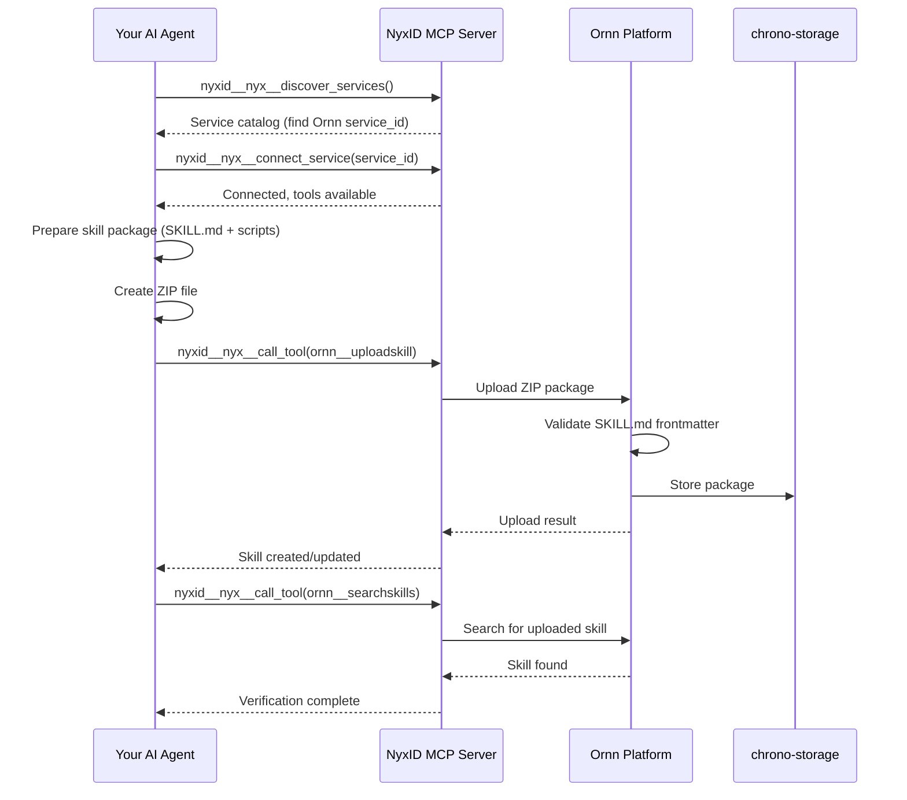

# Ornn Skill Upload Guide

## Overview

This skill teaches AI agents how to **upload a skill package** to the Ornn platform using the NyxID MCP server's meta tools. It covers: service connection → package preparation → upload → verification.

## Prerequisites

- Your AI agent must be connected to the **NyxID MCP server**
- You must have a valid skill package (ZIP file) ready to upload

## Step 1 — Connect to the Ornn Service

### 1.1 Discover the Ornn Service

Call `nyxid__nyx__discover_services` to find the Ornn service:

```json
// nyxid__nyx__discover_services result (abridged)
{
  "services": [
    {
      "service_id": "5a036016-b216-43e1-9c6f-f241f445607d",
      "name": "Ornn",
      "slug": "ornn",
      "category": "internal",
      "requires_credential": false
    }
  ]
}
```

### 1.2 Connect to Ornn

Call `nyxid__nyx__connect_service` with the Ornn `service_id`:

```json
{
  "service_id": "5a036016-b216-43e1-9c6f-f241f445607d"
}
```

Once connected, Ornn tools (including `ornn__uploadskill`) become available in your agent's tool list.

## Step 2 — Prepare the Skill Package

Before uploading, ensure your skill package follows the required format.

### Package Structure

```
skill-name/               # Root folder (kebab-case)
├── SKILL.md              # Required — exact casing
├── scripts/              # Optional — executable scripts
│   └── main.js           # .js/.mjs for node, .py for python
├── references/           # Optional — reference docs
└── assets/               # Optional — static files
```

### SKILL.md Frontmatter

The `SKILL.md` file must include valid YAML frontmatter with these fields:

| Field | Required | Description |
|-------|----------|-------------|
| `name` | Yes | kebab-case, 1-64 chars |
| `description` | Yes | 1-1024 chars |
| `version` | No | Semver string (e.g., `1.0.0`) |
| `license` | No | SPDX identifier (e.g., `MIT`) |
| `compatibility` | No | Target AI model |
| `metadata.category` | Yes | `plain`, `tool-based`, `runtime-based`, or `mixed` |
| `metadata.output-type` | Conditional | Required for `runtime-based`/`mixed`: `text` or `file` |
| `metadata.runtime` | Conditional | Required for `runtime-based`/`mixed`: `["node"]` or `["python"]` |
| `metadata.runtime-dependency` | No | npm or pip packages (e.g., `[{library: "@google/genai", version: "*"}]`) |
| `metadata.runtime-env-var` | No | Required env vars in UPPER_SNAKE_CASE |
| `metadata.tool-list` | Conditional | Required for `tool-based`/`mixed` |
| `metadata.tag` | No | Up to 10 tags |

### Example SKILL.md

```markdown
---
name: my-text-summarizer
description: Summarize long text documents into concise bullet points using LLM
version: 1.0.0
metadata:
  category: plain
  tag:
    - summarization
    - text-processing
    - llm
---

# Text Summarizer

## Overview
This skill summarizes long text documents into concise bullet points.

## Instructions
1. Accept the user's text input
2. Break it into logical sections
3. Generate 3-5 bullet points per section
4. Return the consolidated summary
```

### Example for Runtime-Based Skill

```markdown
---
name: web-scraper
description: Scrape web pages and extract structured data
version: 1.0.0
metadata:
  category: runtime-based
  output-type: text
  runtime:
    - node
  runtime-dependency:
    - library: cheerio
      version: "*"
    - library: axios
      version: "*"
  tag:
    - web-scraping
    - data-extraction
---

# Web Scraper
...
```

### Creating the ZIP Package

The package must be a ZIP file **with a root folder** matching the skill name (kebab-case). The root folder must contain at least `SKILL.md`.

```bash
# IMPORTANT: ZIP must contain a root folder, NOT flat files
# Correct — creates my-text-summarizer/SKILL.md inside the ZIP:
cd /path/to/parent-directory
zip -r my-text-summarizer.zip my-text-summarizer/

# WRONG — creates flat SKILL.md without root folder:
# cd /path/to/my-text-summarizer && zip -r ../my-text-summarizer.zip .
# cd /path/to/my-text-summarizer && zip -j ../my-text-summarizer.zip SKILL.md
```

Or programmatically using your runtime's ZIP library — ensure the archive entries are prefixed with the root folder name (e.g., `my-text-summarizer/SKILL.md`, not just `SKILL.md`).

## Step 3 — Upload the Skill

The `ornn__uploadskill` tool accepts the ZIP file as a **base64-encoded string** in the `body` parameter (MCP uses JSON transport, so binary data must be base64-encoded).

### Encoding the ZIP to Base64

```bash
# Encode the ZIP file to base64
base64 -i my-text-summarizer.zip -o - | tr -d '\n'
```

Or programmatically:

```python
import base64
with open("my-text-summarizer.zip", "rb") as f:
    body_b64 = base64.b64encode(f.read()).decode("ascii")
```

### Calling the Upload Tool

Use `nyxid__nyx__call_tool` to call `ornn__uploadskill`:

```json
// nyxid__nyx__call_tool arguments
{
  "tool_name": "ornn__uploadskill",
  "arguments_json": "{\"body\": \"<base64-encoded ZIP>\", \"skip_validation\": false}"
}
```

### Upload Parameters

| Parameter | Type | Required | Default | Description |
|-----------|------|----------|---------|-------------|
| `body` | string | Yes | — | Base64-encoded ZIP file content |
| `skip_validation` | boolean | No | `false` | Skip format validation (useful for legacy packages) |

> **Note:** NyxID decodes the base64 `body` back to binary before forwarding it to Ornn as `application/zip`. Keep the ZIP small — very large base64 payloads may hit MCP transport limits.

### Upload Behavior

- If a skill with the **same name** already exists for this user, it will be **updated as a new version**
- If the skill name is new, a **new skill entry** is created
- Validation checks the `SKILL.md` frontmatter format unless `skip_validation` is set to `true`

### Constraints

| Constraint | Value |
|------------|-------|
| Max package size | 50 MB |
| Max tags per skill | 10 |
| Name format | kebab-case, 1-64 chars |
| Description length | 1-1024 chars |

## Step 4 — Verify the Upload

After uploading, verify the skill is available by searching for it:

```json
// nyxid__nyx__call_tool arguments
{
  "tool_name": "ornn__searchskills",
  "arguments_json": "{\"query\": \"my-text-summarizer\", \"mode\": \"keyword\", \"scope\": \"private\"}"
}
```

Or retrieve it directly by name:

```json
// nyxid__nyx__call_tool arguments
{
  "tool_name": "ornn__getskill",
  "arguments_json": "{\"idOrName\": \"my-text-summarizer\"}"
}
```

This returns the full metadata including timestamps, visibility, and a `presignedPackageUrl` for downloading the uploaded package.

## Complete Workflow Diagram



## Tips

- **Always validate first** — Keep `skip_validation: false` unless you have a specific reason to skip it. Validation catches frontmatter errors early.
- **Use meaningful names** — The skill `name` in frontmatter is the unique identifier. Choose descriptive kebab-case names.
- **Version your skills** — Include a `version` field to track iterations. Ornn treats each upload of an existing name as a new version.
- **Tag generously** — Tags improve discoverability for both keyword and semantic search. Use up to 10 relevant tags.
- **Check required fields** — `runtime-based` and `mixed` categories require `output-type` and `runtime` fields. Missing these will cause validation failure.
