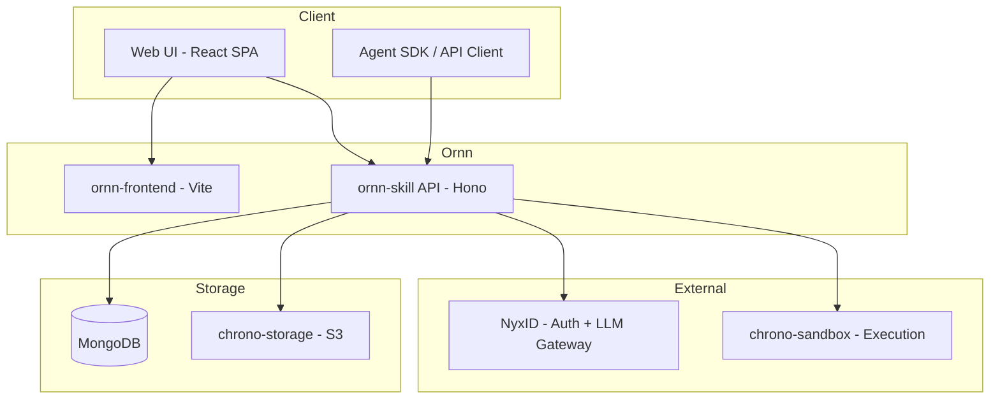

# Ornn Architecture Overview

## System Architecture

## Components

### ornn-skill (Backend API)

The backend service built with **Hono** on **Bun**. Handles:

- Skill CRUD operations
- Search (keyword + semantic)
- Skill generation (AI-powered via NyxID LLM Gateway)
- Playground chat (streaming SSE)
- Admin operations (categories, tags)

### ornn-frontend (Web UI)

The React 19 SPA built with **Vite**. Features:

- Skill browsing and search
- Three creation modes (Guided, Free, Generative)
- Interactive playground
- Admin panel

### Data Layer

| Store | Purpose |
|-------|---------|
| **MongoDB** | Skill metadata, user data, categories, tags |
| **chrono-storage** | Skill package files (ZIP storage) |
