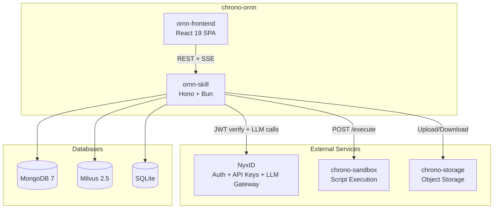
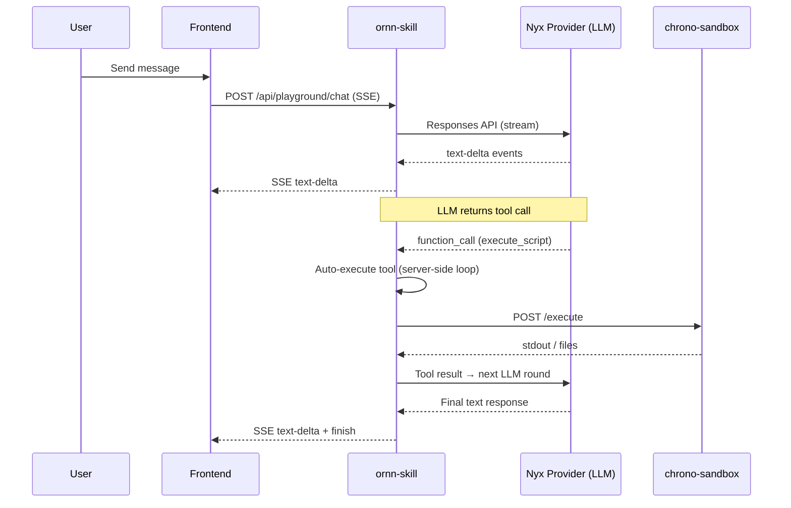
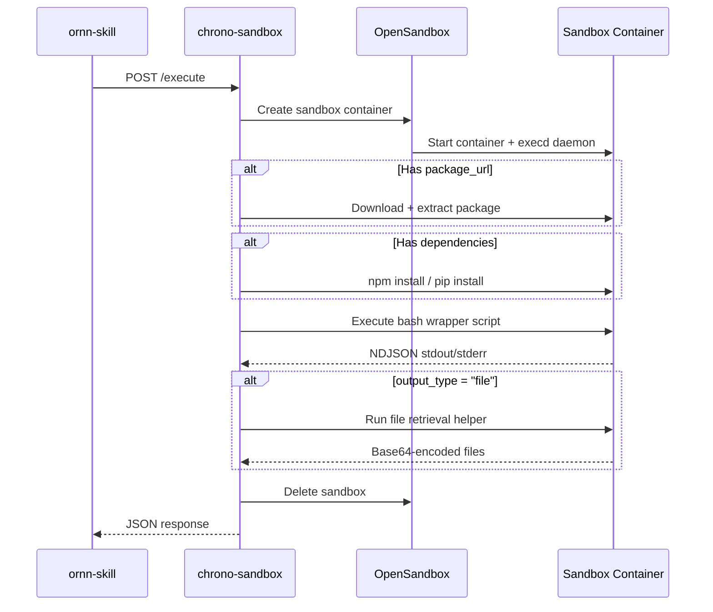

# Architecture

## 1. Overview

Chrono-Ornn is an AI skill platform for creating, publishing, searching, and executing AI skills. A "skill" is a packaged prompt + optional scripts that AI agents can discover and run.

The platform consists of two components:

| Component | Role | Tech |
|-----------|------|------|
| **ornn-skill** | Backend API server | Hono, Bun, MongoDB, Milvus, SQLite |
| **ornn-frontend** | Web UI | React 19, Vite, Zustand, TanStack Query, Tailwind CSS 4 |



## 2. External Dependencies

| Service | Role |
|---------|------|
| **NyxID** | OAuth authentication, JWT token issuance/verification, API key management, LLM Gateway (Nyx Provider) |
| **Nyx Provider** | LLM Gateway within NyxID — routes model requests to OpenAI/Anthropic/Google/etc. using Responses API format |
| **chrono-sandbox** | Sandboxed script execution (based on OpenSandbox). Supports Node.js and Python runtimes |
| **chrono-storage** | S3-compatible object storage for skill packages |
| **MongoDB 7** | Skill metadata, categories, tags |
| **Milvus 2.5** | Vector search for semantic skill discovery (SBERT 384-dim embeddings) |
| **SQLite** | Playground credential storage (AES-256-GCM encrypted) |

## 3. ornn-skill (Backend)

### 3.1 Tech Stack

| Tech | Purpose |
|------|---------|
| Hono | HTTP framework |
| Bun | Runtime |
| MongoDB driver | Skill metadata + admin CRUD |
| @zilliz/milvus2-sdk-node | Vector search |
| jose | JWT verification (NyxID tokens) |
| JSZip | Skill package parsing |
| @xenova/transformers | SBERT embedding generation |
| Pino | Structured logging |
| Zod | Request/response validation |
| yaml | SKILL.md frontmatter parsing |

### 3.2 Source Structure

```
ornn-skill/src/
├── index.ts                    # Entrypoint
├── bootstrap.ts                # Service startup + dependency injection
├── middleware/
│   └── nyxidAuth.ts            # NyxID JWT verification + permission checks
├── domains/
│   ├── skillCrud/              # Skill CRUD (create/read/update/delete)
│   ├── skillSearch/            # Keyword + semantic search
│   ├── skillGeneration/        # AI skill generation (SSE streaming)
│   ├── skillFormat/            # Format rules + validation
│   ├── playground/             # Chat + credential management
│   └── admin/                  # Category + tag management
├── clients/
│   ├── nyxLlmClient.ts        # Nyx Provider LLM Gateway (Responses API)
│   ├── sandboxClient.ts       # chrono-sandbox HTTP client
│   ├── storageClient.ts       # chrono-storage HTTP client
│   └── authClient.ts          # NyxID auth introspection
├── infra/
│   ├── config.ts              # Environment variable loading
│   └── db/                    # MongoDB + Milvus connections
└── shared/
    ├── schemas/               # Zod schemas (frontmatter, etc.)
    ├── types/                 # TypeScript type definitions
    └── utils/                 # Utilities (encryption, hashing, embedding)
```

### 3.3 API Routes

```
# Skill CRUD
POST   /api/skills                        Create skill (ZIP upload)
GET    /api/skills/:idOrName              Read skill by GUID or name
PUT    /api/skills/:id                    Update skill
DELETE /api/skills/:id                    Delete skill

# Skill Search
GET    /api/skill-search                  Keyword or semantic search

# Skill Format
GET    /api/skill-format/rules            Format rules doc (public)
POST   /api/skill-format/validate         Validate ZIP package

# Skill Generation
POST   /api/skills/generate               AI generation (SSE stream)

# Playground
POST   /api/playground/chat               Multi-turn chat (SSE stream)
GET    /api/playground/credentials         List credentials
POST   /api/playground/credentials         Create credential
PUT    /api/playground/credentials/:id     Update credential
DELETE /api/playground/credentials/:id     Delete credential

# Admin
GET    /api/admin/categories              List categories
POST   /api/admin/categories              Create category
PUT    /api/admin/categories/:id          Update category
DELETE /api/admin/categories/:id          Delete category
GET    /api/admin/tags                    List tags
POST   /api/admin/tags                    Create tag
DELETE /api/admin/tags/:id               Delete tag

# Health
GET    /health                            Liveness check
```

## 4. ornn-frontend (Web UI)

### 4.1 Tech Stack

| Tech | Purpose |
|------|---------|
| React 19 | UI framework |
| Vite 6 | Dev server + build |
| Zustand 5 | State management |
| TanStack Query 5 | Server state + caching |
| React Router 7 | Routing |
| Tailwind CSS 4 | Styling |
| Framer Motion | Animations |
| React Hook Form + Zod | Form validation |
| react-markdown | Markdown rendering |
| highlight.js | Code syntax highlighting |

### 4.2 Pages

| Page | Path | Description |
|------|------|-------------|
| ExplorePage | `/` | Browse and search public skills |
| SkillDetailPage | `/skills/:idOrName` | View skill details |
| CreateSkillGuidedPage | `/skills/new/guided` | Step-by-step skill creation wizard |
| CreateSkillFreePage | `/skills/new/free` | Free-form SKILL.md editor |
| CreateSkillGenerativePage | `/skills/new/generate` | AI-powered skill generation |
| UploadSkillPage | `/skills/new` | Upload ZIP package |
| EditSkillPage | `/skills/:id/edit` | Edit existing skill |
| MySkillsPage | `/my-skills` | User's own skills |
| PlaygroundPage | `/playground` | Interactive skill testing with AI chat |
| SettingsPage | `/settings` | User settings |
| AdminCategoriesPage | `/admin/categories` | Manage categories |
| AdminTagsPage | `/admin/tags` | Manage tags |

## 5. Skill Format

### 5.1 Package Structure

```
skill-name/
├── SKILL.md          # Required — frontmatter + usage docs
├── scripts/          # Optional — executable scripts
├── references/       # Optional — reference documents
└── assets/           # Optional — static assets
```

### 5.2 SKILL.md Frontmatter

```yaml
---
name: "my-skill"
description: "What this skill does"
version: "1.0.0"
license: "MIT"
compatibility: "Claude 3.5+"

metadata:
  category: "runtime-based"      # plain | tool-based | runtime-based | mixed
  output-type: "text"            # text | file (required for runtime-based/mixed)
  runtime:
    - "node"                     # node | python
  runtime-dependency:
    - "axios"
  runtime-env-var:
    - "API_KEY"
  tag:
    - "automation"
---
```

### 5.3 Available Runtimes

| Runtime | Language | Script Extension | Package Manager |
|---------|----------|-----------------|-----------------|
| `node` | JavaScript | `.js` / `.mjs` | npm |
| `python` | Python | `.py` | pip |

### 5.4 Category Validation Rules

| Category | Required Fields | Forbidden Fields |
|----------|----------------|-----------------|
| `plain` | — | runtime, toolList, runtimeDependency, runtimeEnvVar, outputType |
| `tool-based` | toolList (non-empty) | runtime, runtimeDependency, runtimeEnvVar, outputType |
| `runtime-based` | runtime (non-empty), outputType | toolList |
| `mixed` | runtime + toolList (both non-empty), outputType | — |

## 6. Playground

### 6.1 Chat Flow



### 6.2 Tool-Use Loop

The playground uses a **server-side tool-use loop** (max 5 rounds). When the LLM emits a `function_call`, the backend auto-executes it and feeds the result back to the LLM for the next round. No frontend approval is required.

Built-in tools:

| Tool | Description |
|------|-------------|
| `skill_search` | Search skills by keyword or semantic similarity |
| `execute_script` | Execute a script in chrono-sandbox with env vars + dependencies |

### 6.3 Credentials

User-provided secrets (API keys, tokens) stored in SQLite with AES-256-GCM encryption. Injected as environment variables into sandbox execution.

## 7. Sandbox Integration

### 7.1 Execution Flow



### 7.2 Output Types

| output-type | Behavior |
|-------------|----------|
| `text` | chrono-sandbox returns stdout as the result |
| `file` | chrono-sandbox retrieves generated files (base64), ornn-skill uploads to chrono-storage and returns presigned URLs |

## 8. LLM Integration (Nyx Provider)

All LLM calls go through NyxID's LLM Gateway using **Responses API** format:

- Endpoint: `/v1/responses`
- Messages field: `input` (not `messages`)
- System role: `developer` (not `system`)
- Max tokens: `max_output_tokens` (not `max_tokens`)
- User token forwarded for per-user provider routing

Model routing by prefix:

| Prefix | Provider |
|--------|----------|
| `gpt-*`, `o1-*`, `o3-*`, `o4-*` | OpenAI |
| `claude-*` | Anthropic |
| `gemini-*` | Google |
| `deepseek-*` | DeepSeek |

## 9. Data Storage

### 9.1 MongoDB Collections

| Collection | Purpose |
|------------|---------|
| `skills` | Skill metadata (name, description, category, metadata, storageKey, createdBy, etc.) |
| `categories` | Predefined skill categories |
| `tags` | Predefined skill tags |

### 9.2 Milvus

| Collection | Purpose |
|------------|---------|
| `skill_embeddings` | 384-dim SBERT vectors for semantic search (HNSW index, cosine similarity >= 0.5) |

### 9.3 SQLite

| Table | Purpose |
|-------|---------|
| `playground_credentials` | Encrypted user credentials (per-user AES-256-GCM) |

## 10. Environment Variables

```bash
# Service
PORT=3802
LOG_LEVEL=info
LOG_PRETTY=false

# NyxID
NYXID_JWKS_URL=https://nyxid.example.com/.well-known/jwks.json
NYXID_ISSUER=https://nyxid.example.com
NYXID_AUDIENCE=https://ornn.example.com
NYXID_INTROSPECTION_URL=https://nyxid.example.com/oauth/introspect
NYXID_CLIENT_ID=ornn-skill
NYXID_CLIENT_SECRET=<secret>

# Nyx Provider (LLM Gateway)
NYX_LLM_GATEWAY_URL=https://nyxid.example.com/llm

# MongoDB
MONGODB_URI=mongodb://localhost:27017
MONGODB_DB=ornn

# Milvus
MILVUS_URI=http://localhost:19530
MILVUS_COLLECTION_NAME=skill_embeddings
SKILL_SEARCH_SIMILARITY_THRESHOLD=0.5

# chrono-storage
STORAGE_SERVICE_URL=http://chrono-storage:3805
STORAGE_BUCKET=ornn

# chrono-sandbox
SANDBOX_SERVICE_URL=http://chrono-sandbox:8080

# Playground
PLATFORM_MASTER_KEY=<hex-encoded-32-bytes>
DATA_DIR=./data

# LLM defaults
DEFAULT_LLM_MODEL=gpt-4o
LLM_MAX_OUTPUT_TOKENS=8192
LLM_TEMPERATURE=0.7
SSE_KEEP_ALIVE_INTERVAL_MS=15000

# Skill package
MAX_PACKAGE_SIZE_BYTES=52428800
```

## 11. Docker

All Docker orchestration lives in **chrono-docker-compose** (a separate repo). The ornn repo does not contain docker-compose files.

Each component has its own Dockerfile:
- `ornn-skill/Dockerfile`
- `ornn-frontend/Dockerfile`

Infrastructure services (MongoDB, Milvus) and external services (chrono-sandbox, chrono-storage, NyxID) are managed in chrono-docker-compose.
