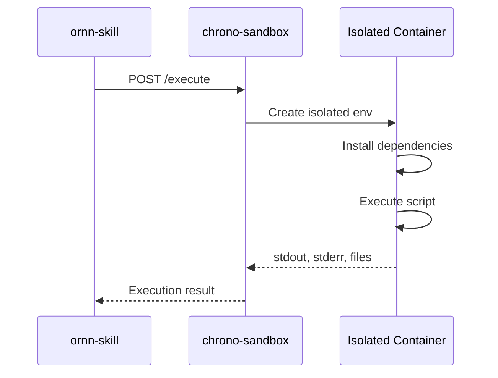

# chrono-sandbox

## Overview

chrono-sandbox is an isolated execution environment for running skill scripts. It is based on OpenSandbox and supports Node.js and Python runtimes.

## Supported Runtimes

| Runtime | Version | Package Manager |
|---------|---------|-----------------|
| Node.js | 20.x | npm |
| Python | 3.12 | pip |

## Execution Flow



## API

### Execute Script

```bash
POST /execute
Content-Type: application/json

{
  "runtime": "node",
  "entrypoint": "main.ts",
  "files": { "main.ts": "console.log('hello')" },
  "dependencies": ["axios@1.6.0"],
  "envVars": { "API_KEY": "..." },
  "timeout": 30000
}
```

### Response

```json
{
  "exitCode": 0,
  "stdout": "hello\n",
  "stderr": "",
  "files": []
}
```

## Security

- Each execution runs in a fully isolated container
- Network access is restricted
- File system is sandboxed
- CPU and memory limits are enforced
- Execution timeout prevents infinite loops
