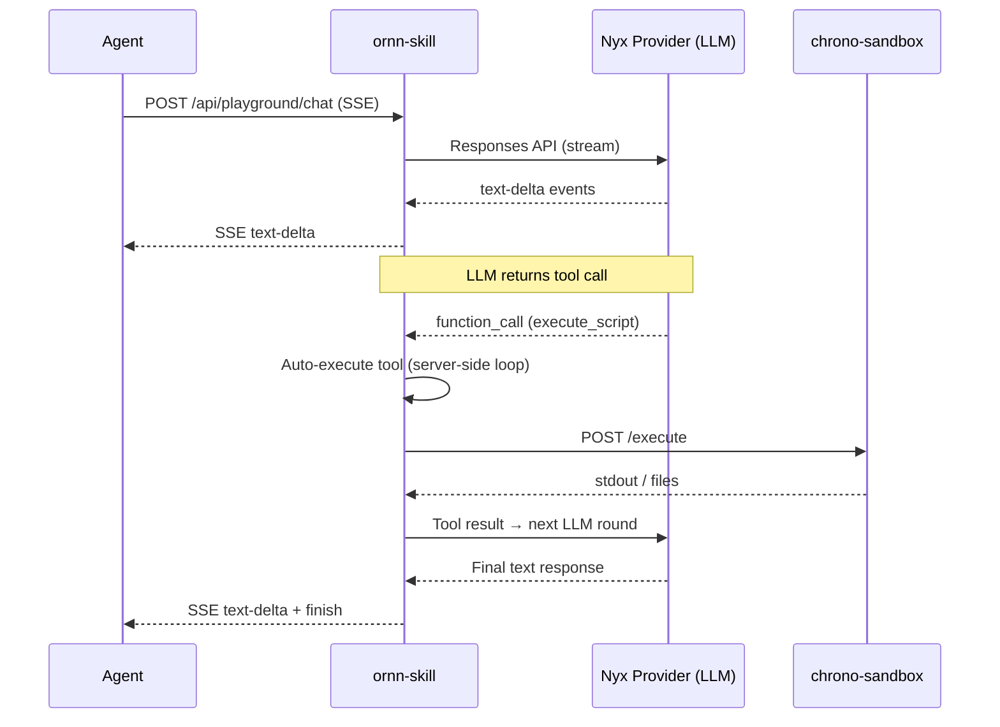

# Developer Guide

## Overview

Ornn exposes a REST API that AI agents can use to discover and execute skills. Agents connect to ornn-skill's API endpoints using NyxID authentication (JWT or API key).

## Authentication

All API requests require a NyxID token:

```
Authorization: Bearer <nyxid-jwt-or-api-key>
```

Two authentication methods:
- **JWT** — Obtained through NyxID OAuth flow
- **API Key** — Generated in NyxID (format: `nyx_<64-hex>`), validated via NyxID introspection

## Core API Endpoints

### Search Skills

```
GET /api/skill-search?query=<text>&mode=keyword&scope=public&page=1&pageSize=9
```

| Parameter | Type | Default | Description |
|-----------|------|---------|-------------|
| `query` | string | — | Search text (optional, max 2000 chars) |
| `mode` | `keyword` \| `similarity` | `keyword` | Search mode |
| `scope` | `public` \| `private` \| `mixed` | `private` | Which skills to search |
| `page` | number | 1 | Page number |
| `pageSize` | number | 9 | Results per page (max 100) |

Response:
```json
{
  "data": [
    {
      "guid": "uuid",
      "name": "skill-name",
      "description": "...",
      "metadata": { "category": "runtime-based", "outputType": "text" },
      "tags": ["tag1"],
      "presignedPackageUrl": "https://..."
    }
  ],
  "pagination": { "page": 1, "pageSize": 9, "total": 42 }
}
```

### Get Skill Details

```
GET /api/skills/:idOrName
```

Returns full skill metadata including a presigned URL to download the package.

### Get Skill Format Rules

```
GET /api/skill-format/rules
```

Returns the complete skill format specification as Markdown. Useful for agents that create skills programmatically.

### Create a Skill

```
POST /api/skills
Content-Type: application/zip
Body: <ZIP bytes>
```

Upload a skill package (ZIP). The package must contain a valid `SKILL.md` with correct frontmatter.

### Update a Skill

```
PUT /api/skills/:id
Content-Type: application/zip
Body: <ZIP bytes>
```

### Delete a Skill

```
DELETE /api/skills/:id
```

### Toggle Visibility

```
PATCH /api/skills/:id/visibility
Content-Type: application/json

{ "isPublic": true }
```

## Executing Skills

Agents don't call chrono-sandbox directly. Instead, use the **Playground Chat** endpoint which handles the full execution lifecycle:

```
POST /api/playground/chat
Content-Type: application/json

{
  "model": "gpt-4o",
  "input": [
    { "role": "user", "content": "Run the chart-generator skill with this data..." }
  ]
}
```

Response: SSE stream with events:
- `text-delta` — Streaming text chunks
- `tool-call` — Tool invocation (skill_search, execute_script)
- `tool-result` — Tool execution result
- `finish` — End of response

### Execution Flow



The chat endpoint uses a server-side tool-use loop (max 5 rounds). When the LLM decides to execute a skill, it automatically:
1. Downloads the skill package from chrono-storage
2. Injects user credentials as environment variables
3. Installs dependencies (npm/pip)
4. Executes the script in chrono-sandbox
5. Returns stdout (text) or generated files (uploaded to chrono-storage with presigned URLs)

## NyxID MCP Integration

NyxID can auto-generate an MCP server that exposes ornn's API as MCP tools. This lets Claude Code and other MCP-compatible agents use ornn skills natively:

- `skill_search` — Search the skill library
- `skill_pull` — Download a skill package
- `skill_upload` — Upload a new skill
- `execute_script` — Run a skill's script in sandbox

To set this up, configure the NyxID-generated MCP server in your agent's MCP config and provide your NyxID API key.

## Skill Package Format Reference

```
skill-name/               # Root folder (kebab-case)
├── SKILL.md              # Required — exact casing
├── scripts/              # Optional — executable scripts
│   └── main.js           # .js/.mjs for node, .py for python
├── references/           # Optional — reference docs
└── assets/               # Optional — static files
```

### Frontmatter Fields

| Field | Required | Description |
|-------|----------|-------------|
| `name` | Yes | kebab-case, 1-64 chars |
| `description` | Yes | 1-1024 chars |
| `version` | No | Semver string |
| `license` | No | SPDX identifier |
| `compatibility` | No | Target AI model |
| `metadata.category` | Yes | `plain`, `tool-based`, `runtime-based`, or `mixed` |
| `metadata.output-type` | Conditional | Required for `runtime-based`/`mixed`: `text` or `file` |
| `metadata.runtime` | Conditional | Required for `runtime-based`/`mixed`: `["node"]` or `["python"]` |
| `metadata.runtime-dependency` | No | npm packages or pip packages |
| `metadata.runtime-env-var` | No | Required env vars (UPPER_SNAKE_CASE) |
| `metadata.tool-list` | Conditional | Required for `tool-based`/`mixed` |
| `metadata.tag` | No | Up to 10 tags |

## Rate Limits and Constraints

| Constraint | Value |
|------------|-------|
| Max package size | 50 MB |
| Max search query | 2000 chars |
| Max tags per skill | 10 |
| Sandbox execution timeout | 60s default, 600s max |
| Playground tool-use rounds | 5 max |
