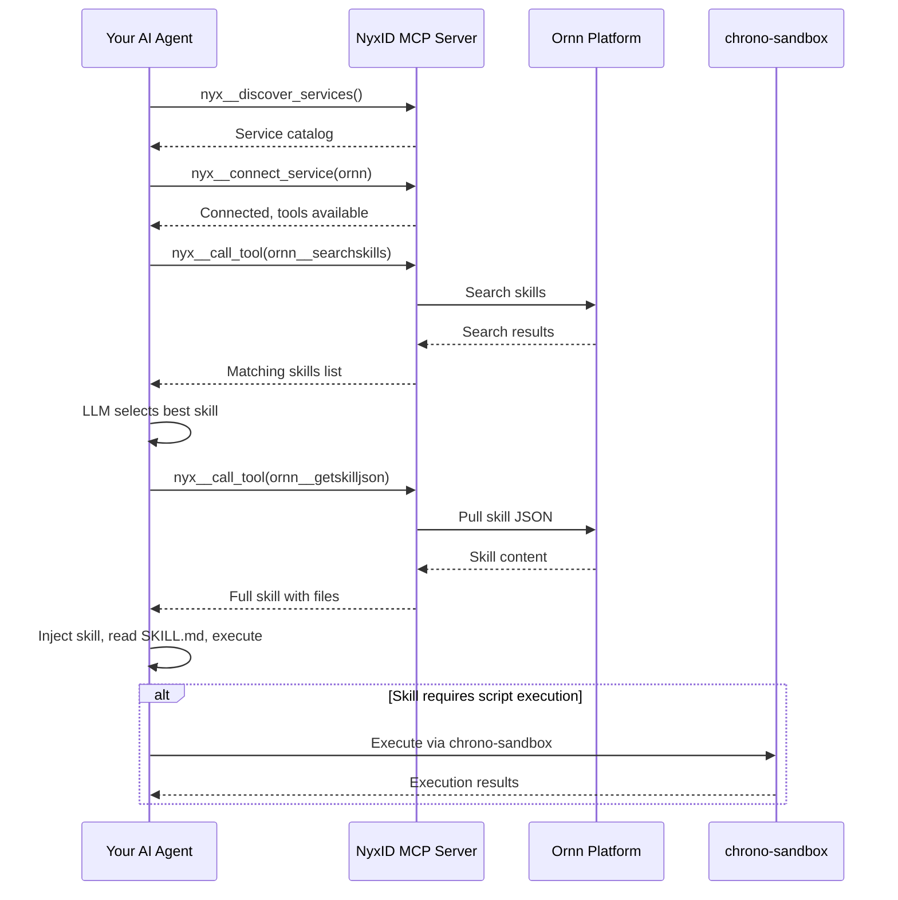

# NyxID MCP Integration

## Overview

NyxID MCP is the central gateway for all Chrono platform services. It handles authentication, authorization, and service routing — your AI agent calls NyxID meta tools to discover, connect, and invoke Ornn services.

## Prerequisites

Your AI agent must be connected to the **NyxID MCP server**. Once connected, your agent has access to four meta tools:

| Tool | Description |
|------|-------------|
| `nyx__discover_services` | Browse available services on this NyxID instance |
| `nyx__connect_service` | Connect to a service to activate its tools |
| `nyx__search_tools` | Search connected tools by keyword |
| `nyx__call_tool` | Execute any connected tool by name |

## Step 1 — Discover Services

Call `nyx__discover_services` to see all services available through NyxID:

```json
// nyx__discover_services result (abridged)
{
  "services": [
    {
      "service_id": "5a036016-b216-43e1-9c6f-f241f445607d",
      "name": "Ornn",
      "slug": "ornn",
      "category": "internal",
      "requires_credential": false
    },
    {
      "service_id": "b6dac2eb-0b36-4514-b600-aeb4cf870cd6",
      "name": "Chrono Sandbox Service",
      "slug": "chrono-sandbox-service",
      "category": "internal",
      "requires_credential": false
    }
  ],
  "count": 22
}
```

The two services relevant to Ornn skill execution are:

| Service | Slug | Purpose |
|---------|------|---------|
| **Ornn** | `ornn` | Skill search, pull, upload, and build |
| **Chrono Sandbox Service** | `chrono-sandbox-service` | Script execution for runtime-based skills |

NyxID also provides proxied access to LLM providers and third-party APIs:

| Category | Services |
|----------|----------|
| **LLM Providers** | OpenAI, Anthropic, Google AI, Mistral AI, Cohere, DeepSeek — all proxied via NyxID LLM gateway |
| **Third-party APIs** | Twitter/X, Google, GitHub, Facebook, Discord, Spotify, Slack, Microsoft Graph, TikTok, Twitch, Reddit |
| **Chrono Internal** | Chrono LLM, Chrono Graph Service, Chrono Storage Service |

> **Note:** Services with `"requires_credential": true` require the user to have connected their own credentials in NyxID. Services marked `"requires_credential": false` are available immediately.

## Step 2 — Connect to Ornn

Call `nyx__connect_service` with the Ornn `service_id`:

```json
{
  "service_id": "5a036016-b216-43e1-9c6f-f241f445607d"
}
```

Response:

```json
{
  "status": "connected",
  "service_name": "Ornn",
  "connected_at": "2026-03-16T08:21:46.590266623+00:00",
  "note": "Service tools are now available. Your tool list has been updated."
}
```

Once connected, Ornn tools appear in your agent's tool list. You only need to connect once per session.

## Step 3 — Browse Ornn Tools

Use `nyx__search_tools` to discover the tools Ornn provides:

```json
{ "query": "ornn" }
```

| Tool | Description |
|------|-------------|
| `ornn__searchskills` | Search skills by keyword or semantic similarity |
| `ornn__getskill` | Get skill metadata by GUID or name (includes package download URL) |
| `ornn__getskilljson` | Get skill package as JSON with all file contents (preferred for agents) |
| `ornn__uploadskill` | Upload a ZIP-packaged skill to the registry |
| `ornn__generateskill` | Generate a skill via AI from natural language (SSE stream) |

## Ornn Tool Reference

### `ornn__searchskills` — Find skills

| Parameter | Type | Default | Description |
|-----------|------|---------|-------------|
| `query` | string | `""` | Free-text search query (max 2000 chars). Empty returns all skills |
| `mode` | `"keyword"` \| `"semantic"` | `"keyword"` | Keyword for text matching (fast), semantic for LLM-based conceptual search |
| `scope` | `"public"` \| `"private"` \| `"mixed"` | `"private"` | Visibility filter |
| `page` | integer | `1` | Page number (starting from 1) |
| `pageSize` | integer | `9` | Results per page (1–100) |
| `model` | string | — | LLM model for semantic mode (optional, uses platform default) |

### `ornn__getskilljson` — Pull skill contents

| Parameter | Type | Required | Description |
|-----------|------|----------|-------------|
| `idOrName` | string | yes | Skill UUID or unique name (e.g. `"web-summarizer"`) |

Returns the skill's name, description, metadata, and a `files` map where each key is a relative file path and each value is the full text content. This is the preferred endpoint for AI agents.

### `ornn__getskill` — Get skill metadata

| Parameter | Type | Required | Description |
|-----------|------|----------|-------------|
| `idOrName` | string | yes | Skill UUID or unique name |

Returns metadata, tags, visibility status, timestamps, and a `presignedPackageUrl` for downloading the raw ZIP package.

### `ornn__uploadskill` — Upload a skill

| Parameter | Type | Required | Default | Description |
|-----------|------|----------|---------|-------------|
| `body` | string | yes | — | Base64-encoded ZIP file content |
| `skip_validation` | boolean | no | `false` | Skip format validation (useful for legacy packages) |

Upload a ZIP package containing at least a `SKILL.md` with valid YAML frontmatter. The ZIP must contain a root folder. NyxID decodes the base64 body to binary before forwarding to Ornn.

### `ornn__generateskill` — AI skill generation

| Parameter | Type | Description |
|-----------|------|-------------|
| `prompt` | string | Single-turn description of the skill to generate. Mutually exclusive with `messages` |
| `messages` | array | Multi-turn conversation history for iterative refinement. Mutually exclusive with `prompt` |
| `model` | string | LLM model to use (optional, uses platform default) |

Returns an SSE stream with events: `generation_start`, `token` (incremental output), `generation_complete` (full skill content), `validation_error`, and `error`.

## Step 4 — Call Tools

All Ornn tools are invoked through `nyx__call_tool`. Pass the `tool_name` and `arguments_json` (a JSON string of the tool's parameters):

```json
{
  "tool_name": "ornn__searchskills",
  "arguments_json": "{\"query\": \"marketing image generation\", \"mode\": \"semantic\", \"scope\": \"mixed\"}"
}
```

Example response:

```json
{
  "data": {
    "searchMode": "semantic",
    "searchScope": "mixed",
    "total": 1,
    "items": [
      {
        "guid": "5567ae54-55a8-4ca2-aa51-dd80d1958127",
        "name": "gemini-marketing-image-generation",
        "description": "Generate marketing images using the @google/genai library...",
        "tags": ["gemini", "image-generation", "marketing", "google-genai"]
      }
    ]
  },
  "error": null
}
```

## Complete Workflow


