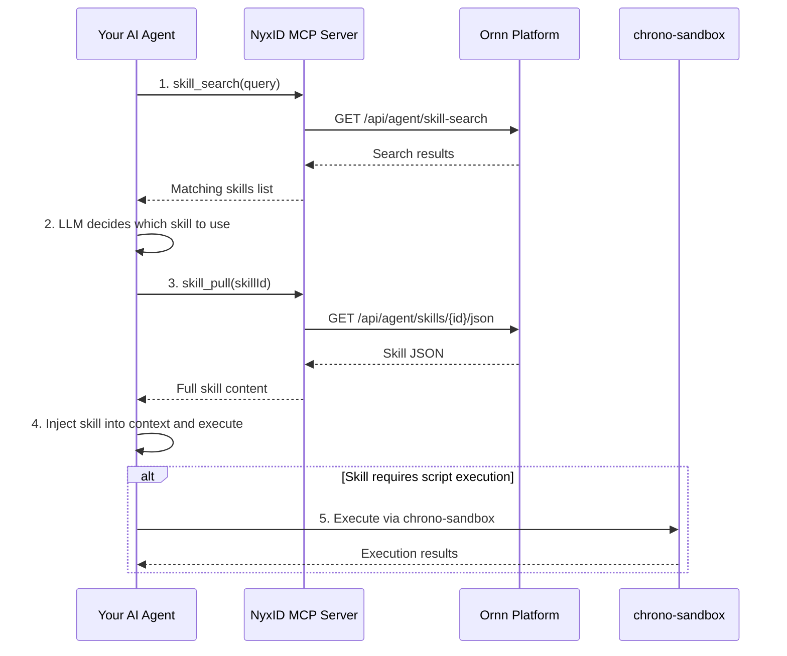

# Quick Start as an AI Agent Developer

## Overview

All skills on the Ornn platform are available for direct use by AI agents. Ornn exposes four agent services — **skill search**, **skill pull**, **skill upload**, and **skill build** — through the NyxID remote MCP server, which provides these as tools for AI agents to call.

> **The simplest path:** If your agent is already connected to the NyxID MCP server, it automatically has access to every skill on the Ornn platform!

## Recommended Workflow



### Step 1 — Search for relevant skills

Based on your specific need, call **skill search** with a semantic query to find related skills.

```json
// skill_search tool arguments
{
  "query": "generate images from text description using AI",
  "mode": "semantic",
  "scope": "public"
}
```

### Step 2 — Select a skill

Let your agent's LLM review the search results and decide which skill to use based on the name, description, and tags returned.

### Step 3 — Pull the skill

Pass the selected skill ID or name into the **skill pull** tool to fetch the full skill JSON, including all file contents.

```json
// skill_pull tool arguments
{
  "idOrName": "gemini-image-gen"
}
```

The response contains the complete skill package: SKILL.md content, scripts, references, and all metadata.

### Step 4 — Inject and execute

Inject the skill JSON into your agent's context and let the agent begin executing the skill autonomously.

### Step 5 — Script execution

If the skill involves code or script execution, you have two options:

- **Self-execution** — If your AI agent has code execution capabilities (e.g., a sandboxed runtime), it can execute the scripts directly
- **chrono-sandbox** — If your agent does not have code execution capabilities, call the chrono platform's sandbox service to run scripts and return results

## Manual Alternative

You can always download a skill package and manually configure it for your AI agent. However, we strongly recommend using the NyxID MCP approach described above — it significantly reduces manual work and enables fully automated skill discovery and application.
