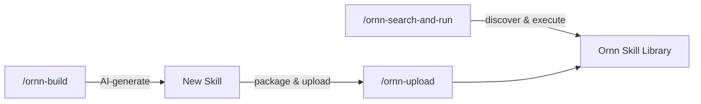

# Quick Start as an AI Agent Developer

## Overview

All skills on the Ornn platform are available for direct use by AI agents. Ornn exposes four agent services — **skill search**, **skill pull**, **skill upload**, and **skill build** — through the NyxID remote MCP server, which provides these as tools for AI agents to call.

> **The simplest path:** If your agent is already connected to the NyxID MCP server, it automatically has access to every skill on the Ornn platform!

## Install Ornn Core Skills

Ornn provides three **core skills** that automate the entire workflow — search, build, and upload — so your agent can use them as simple slash commands instead of calling tools manually.

Pick the installation prompt for your agent platform, copy it, and paste it into your agent:

### Claude Code

```
Fetch the three Ornn core skill directories from https://github.com/aevatarAI/chrono-ornn/tree/main/ornn-core-skills — each directory (ornn-search-and-run, ornn-upload, ornn-build) contains a SKILL.md file. Download each SKILL.md and create the corresponding skill folder in my project's .claude/skills/ directory. The final structure should be:

.claude/skills/ornn-search-and-run/SKILL.md
.claude/skills/ornn-upload/SKILL.md
.claude/skills/ornn-build/SKILL.md
```

### OpenAI Codex

```
Fetch the three Ornn core skill files from https://github.com/aevatarAI/chrono-ornn/tree/main/ornn-core-skills — each directory (ornn-search-and-run, ornn-upload, ornn-build) contains a SKILL.md file. Download each SKILL.md and save them into my project's codex/skills/ directory. The final structure should be:

codex/skills/ornn-search-and-run/SKILL.md
codex/skills/ornn-upload/SKILL.md
codex/skills/ornn-build/SKILL.md

Then add a reference to these skills in my AGENTS.md file (create it if it doesn't exist) so that Codex can discover and invoke them.
```

### Cursor

```
Fetch the three Ornn core skill files from https://github.com/aevatarAI/chrono-ornn/tree/main/ornn-core-skills — each directory (ornn-search-and-run, ornn-upload, ornn-build) contains a SKILL.md file. Download each SKILL.md and save them as rule files in my project's .cursor/rules/ directory. The final structure should be:

.cursor/rules/ornn-search-and-run.md
.cursor/rules/ornn-upload.md
.cursor/rules/ornn-build.md
```

### Antigravity

```
Fetch the three Ornn core skill directories from https://github.com/aevatarAI/chrono-ornn/tree/main/ornn-core-skills — each directory (ornn-search-and-run, ornn-upload, ornn-build) contains a SKILL.md file. Download each SKILL.md and create the corresponding skill folder in my project's .antigravity/skills/ directory. The final structure should be:

.antigravity/skills/ornn-search-and-run/SKILL.md
.antigravity/skills/ornn-upload/SKILL.md
.antigravity/skills/ornn-build/SKILL.md
```

## How to Use the Core Skills

Once installed, the three skills are available as slash commands. Each skill guides your agent through the full NyxID MCP workflow (service discovery → connection → tool calls) automatically.

> **Prerequisite:** Your agent must be connected to a NyxID MCP server. See [NyxID MCP Integration](nyxid-mcp-integration) for setup details and tool reference.

### `/ornn-search-and-run` — Discover and Execute Skills

Search the Ornn skill library, pull a skill, and execute it — all in one command.

**When to use:**
- You need a capability your agent doesn't have (translation, image generation, data conversion, etc.)
- You want to find and run a community skill without writing any code
- You need a quick one-off task handled by a specialized skill

**Examples:**

```
/ornn-search-and-run Find a Korean translation skill and translate: Hello, I am a robot
```

The agent will: search Ornn → find `any-language-to-korean-translation` → pull its SKILL.md → follow the plain skill instructions → output: **안녕하세요, 저는 로봇입니다.**

```
/ornn-search-and-run Search for an image generation skill and generate a logo for my startup
```

```
/ornn-search-and-run Find a skill that summarizes web pages, then summarize https://example.com
```

**What happens under the hood:**

| Step | Agent action |
|------|-------------|
| 1. Search | Calls `ornn__searchskills` with semantic mode to find matching skills |
| 2. Select | LLM reviews results and picks the best match |
| 3. Pull | Calls `ornn__getskilljson` to download the skill's SKILL.md and any scripts |
| 4. Execute | Reads SKILL.md instructions. For `plain` skills, follows the prompt directly. For `runtime-based` skills, executes scripts via sandbox |

### `/ornn-build` — Generate New Skills with AI

Describe what you want in natural language, and Ornn's AI generates a complete skill package.

**When to use:**
- You need a reusable capability that doesn't exist in the library yet
- You want to package a prompt or script into a shareable skill
- You're building a skill library for your team

**Examples:**

```
/ornn-build Create a plain skill that detects sensitive information (API keys, passwords, PII) in text
```

The agent will: call `ornn__generateskill` → stream the generated SKILL.md → present the result for review.

```
/ornn-build Build a Node.js skill that converts CSV files to JSON using the csv-parse library
```

```
/ornn-build Generate a skill that reviews pull request descriptions for completeness
```

**Multi-turn refinement:** If the first generation isn't quite right, just tell the agent what to change. It will call `ornn__generateskill` again with the conversation history to iterate.

### `/ornn-upload` — Package and Upload Skills

Package a skill into a ZIP and upload it to the Ornn registry so others can discover and use it.

**When to use:**
- After generating a skill with `/ornn-build`, you want to publish it
- You have a local skill directory you want to share with your team
- You want to version an existing skill (uploading with the same name creates a new version)

**Examples:**

```
/ornn-upload Upload the skill we just generated
```

```
/ornn-upload Package and upload my-custom-skill/ to Ornn
```

**Key details:**
- ZIP must contain a root folder with the skill name (e.g., `my-skill/SKILL.md`)
- The `body` parameter is the base64-encoded ZIP
- If a skill with the same name already exists, it creates a new version

### End-to-End Example

Here's a complete session using all three skills together:

```
# 1. Search for an existing skill and use it
/ornn-search-and-run Find a Korean translation skill and translate: Hello, I am Claude

# 2. Generate a brand new skill
/ornn-build Create a plain skill that detects sensitive information in text

# 3. Review the generated output, then upload it
/ornn-upload Upload the sensitive-information-detector skill we just created
```



## Manual Alternative

You can always download a skill package and manually configure it for your AI agent. However, we strongly recommend using the core skills described above — they significantly reduce manual work and enable fully automated skill discovery and application.

For low-level tool reference and NyxID MCP setup details, see [NyxID MCP Integration](nyxid-mcp-integration).
