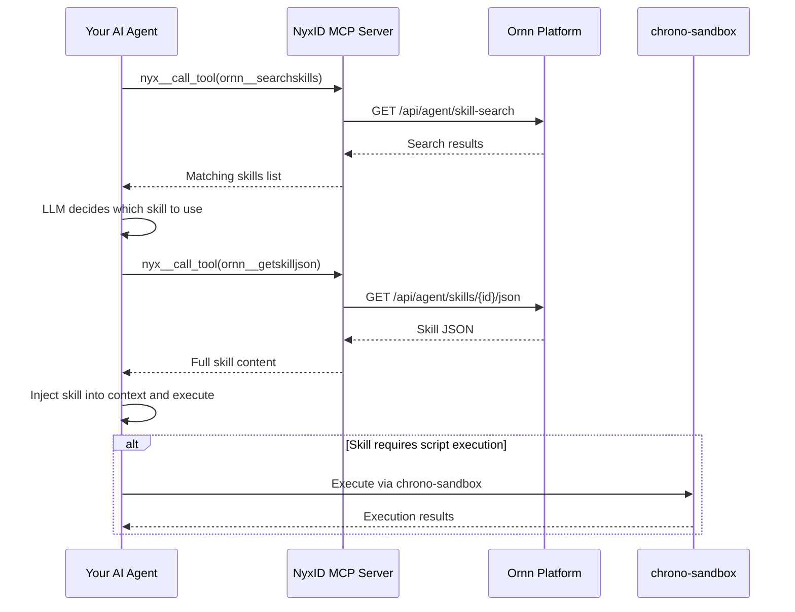

# Quick Start as an AI Agent Developer

## Overview

All skills on the Ornn platform are available for direct use by AI agents. Ornn exposes four agent services — **skill search**, **skill pull**, **skill upload**, and **skill build** — through the NyxID remote MCP server, which provides these as tools for AI agents to call.

> **The simplest path:** If your agent is already connected to the NyxID MCP server, it automatically has access to every skill on the Ornn platform!

## Prerequisites

Your AI agent must be connected to the **NyxID MCP server**. NyxID MCP is the central gateway for all Chrono platform services — it handles authentication, authorization, and service routing so your agent doesn't have to.

### Discovering Available Services

Before using Ornn skills, your agent can call `nyxid__discover_services` to see all services available through NyxID. This returns the full service catalog:

```json
// nyxid__discover_services result (abridged)
{
  "services": [
    {
      "service_id": "5a036016-b216-43e1-9c6f-f241f445607d",
      "name": "Ornn",
      "slug": "ornn",
      "description": "",
      "category": "internal",
      "requires_credential": false
    },
    {
      "service_id": "b6dac2eb-0b36-4514-b600-aeb4cf870cd6",
      "name": "Chrono Sandbox Service",
      "slug": "chrono-sandbox-service",
      "description": "",
      "category": "internal",
      "requires_credential": false
    }
  ],
  "count": 22
}
```

The two services relevant to Ornn skill execution are:

| Service | Slug | Purpose |
|---------|------|---------|
| **Ornn** | `ornn` | Skill search, pull, upload, and build |
| **Chrono Sandbox Service** | `chrono-sandbox-service` | Script execution for runtime-based skills |

NyxID also provides proxied access to LLM providers and third-party APIs that your skills may depend on:

| Category | Services |
|----------|----------|
| **LLM Providers** | OpenAI, Anthropic, Google AI, Mistral AI, Cohere, DeepSeek — all proxied via NyxID LLM gateway |
| **Third-party APIs** | Twitter/X, Google, GitHub, Facebook, Discord, Spotify, Slack, Microsoft Graph, TikTok, Twitch, Reddit |
| **Chrono Internal** | Chrono LLM, Chrono Graph Service, Chrono Storage Service |

> **Note:** Services with `"requires_credential": true` (e.g., Chrono LLM) require the user to have connected their own credentials in NyxID. Services marked `"requires_credential": false` are available immediately through the NyxID proxy.

### Connecting to a Service

After discovering services, your agent must **connect** to a service before its tools become available. Call `nyxid__connect_service` with the `service_id` from the discovery result:

```json
// nyxid__connect_service tool arguments
{
  "service_id": "5a036016-b216-43e1-9c6f-f241f445607d"
}
```

A successful response confirms the connection and indicates that service-specific tools are now available:

```json
{
  "status": "connected",
  "service_name": "Ornn",
  "connected_at": "2026-03-16T08:21:46.590266623+00:00",
  "note": "Service tools are now available. Your tool list has been updated."
}
```

Once connected, the Ornn tools (`skill_search`, `skill_pull`, `skill_upload`, `skill_build`) appear in your agent's tool list and are ready to use. The same pattern applies to other services — for example, connect to `chrono-sandbox-service` if you need script execution capabilities.

> **Tip:** You only need to connect once per session. The connection persists until the MCP session ends.

### Browsing Available Tools

After connecting to a service, use `nyx__search_tools` to discover the tools it provides. For example, searching for Ornn tools:

```json
// nyx__search_tools tool arguments
{
  "query": "ornn"
}
```

The response lists all matching tools with their names, descriptions, and input schemas:

| Tool | Description |
|------|-------------|
| `ornn__searchskills` | Search skills by keyword or semantic similarity |
| `ornn__getskill` | Get skill metadata by GUID or name (includes package download URL) |
| `ornn__getskilljson` | Get skill package as JSON with all file contents (preferred for agents) |
| `ornn__uploadskill` | Upload a ZIP-packaged skill to the registry |
| `ornn__generateskill` | Generate a skill via AI from natural language (SSE stream) |

Each tool result includes a full `inputSchema` describing its parameters. Here are the key tools in detail:

#### `ornn__searchskills` — Find skills

| Parameter | Type | Default | Description |
|-----------|------|---------|-------------|
| `query` | string | `""` | Free-text search query (max 2000 chars). Empty returns all skills |
| `mode` | `"keyword"` \| `"semantic"` | `"keyword"` | Keyword for text matching (fast), semantic for LLM-based conceptual search |
| `scope` | `"public"` \| `"private"` \| `"mixed"` | `"private"` | Visibility filter |
| `page` | integer | `1` | Page number (starting from 1) |
| `pageSize` | integer | `9` | Results per page (1–100) |
| `model` | string | — | LLM model for semantic mode (optional, uses platform default) |

#### `ornn__getskilljson` — Pull skill contents

| Parameter | Type | Required | Description |
|-----------|------|----------|-------------|
| `idOrName` | string | yes | Skill UUID or unique name (e.g. `"web-summarizer"`) |

Returns the skill's name, description, metadata, and a `files` map where each key is a relative file path and each value is the full text content. This is the preferred endpoint for AI agents.

#### `ornn__getskill` — Get skill metadata

| Parameter | Type | Required | Description |
|-----------|------|----------|-------------|
| `idOrName` | string | yes | Skill UUID or unique name |

Returns metadata, tags, visibility status, timestamps, and a `presignedPackageUrl` for downloading the raw ZIP package.

#### `ornn__uploadskill` — Upload a skill

| Parameter | Type | Default | Description |
|-----------|------|---------|-------------|
| `skip_validation` | boolean | `false` | Skip format validation (useful for legacy packages) |

Upload a ZIP package containing at least a `skill.md` with valid YAML frontmatter. If a skill with the same name already exists for this user, it will be updated as a new version.

#### `ornn__generateskill` — AI skill generation

| Parameter | Type | Description |
|-----------|------|-------------|
| `prompt` | string | Single-turn description of the skill to generate. Mutually exclusive with `messages` |
| `messages` | array | Multi-turn conversation history for iterative refinement. Mutually exclusive with `prompt` |
| `model` | string | LLM model to use (optional, uses platform default) |

Returns an SSE stream with events: `generation_start`, `token` (incremental output), `generation_complete` (full skill content), `validation_error`, and `error`.

### Calling Tools with `nyx__call_tool`

All Ornn tools are invoked through `nyx__call_tool`. Pass the `tool_name` and `arguments_json` (a JSON string of the tool's parameters):

```json
// nyx__call_tool arguments — search for skills
{
  "tool_name": "ornn__searchskills",
  "arguments_json": "{\"query\": \"marketing image generation\", \"mode\": \"semantic\", \"scope\": \"mixed\"}"
}
```

Example response:

```json
{
  "data": {
    "searchMode": "semantic",
    "searchScope": "mixed",
    "total": 1,
    "totalPages": 1,
    "page": 1,
    "pageSize": 9,
    "items": [
      {
        "guid": "5567ae54-55a8-4ca2-aa51-dd80d1958127",
        "name": "gemini-marketing-image-generation",
        "description": "Generate marketing images using the @google/genai library with the gemini-3.1-flash-image-preview model, requiring only GEMINI_API_KEY.",
        "createdBy": "76fe9d91-1f1d-4234-9352-819a7c28f709",
        "createdByEmail": "shining.wang@aelf.io",
        "createdByDisplayName": "chronoai-shining",
        "createdOn": "2026-03-13T06:46:09.625Z",
        "updatedOn": "2026-03-13T09:21:53.051Z",
        "isPrivate": false,
        "tags": ["gemini", "image-generation", "marketing", "google-genai"]
      }
    ]
  },
  "error": null
}
```

Each search result includes `guid` and `name` — use either to pull the full skill content in the next step.

## Recommended Workflow



### Step 1 — Search for relevant skills

Use `nyx__call_tool` to call `ornn__searchskills` with a semantic or keyword query:

```json
{
  "tool_name": "ornn__searchskills",
  "arguments_json": "{\"query\": \"generate images from text description using AI\", \"mode\": \"semantic\", \"scope\": \"public\"}"
}
```

### Step 2 — Select a skill

Let your agent's LLM review the search results and decide which skill to use based on the name, description, and tags returned.

### Step 3 — Pull the skill

Use `nyx__call_tool` to call `ornn__getskilljson` with the selected skill's GUID or name:

```json
{
  "tool_name": "ornn__getskilljson",
  "arguments_json": "{\"idOrName\": \"gemini-marketing-image-generation\"}"
}
```

The response contains the complete skill package — metadata, SKILL.md, and all file contents:

```json
{
  "data": {
    "name": "gemini-marketing-image-generation",
    "description": "Generate marketing images using the @google/genai library with the gemini-3.1-flash-image-preview model, requiring only GEMINI_API_KEY.",
    "metadata": {
      "category": "runtime-based",
      "outputType": "file",
      "runtimes": [
        {
          "runtime": "node",
          "dependencies": [{ "library": "@google/genai", "version": "*" }],
          "envs": [{ "var": "GEMINI_API_KEY", "description": "" }]
        }
      ],
      "tags": ["gemini", "image-generation", "marketing", "google-genai"]
    },
    "files": {
      "SKILL.md": "---\nname: gemini-marketing-image-generation\n...\n---\n\n# Gemini Marketing Image Generation\n\n## Overview\nGenerate a marketing image from a prompt using `@google/genai`...",
      "scripts/main.ts": "import { GoogleGenAI } from '@google/genai';\n\nconst apiKey = process.env.GEMINI_API_KEY;\n..."
    }
  },
  "error": null
}
```

Key fields in the response:

| Field | Description |
|-------|-------------|
| `metadata.category` | Skill type: `plain`, `tool-based`, `runtime-based`, or `mixed` |
| `metadata.outputType` | `text` (stdout) or `file` (generated files) |
| `metadata.runtimes` | Runtime requirements: language, dependencies, and required environment variables |
| `metadata.tags` | Skill tags for categorization |
| `files` | Map of relative file paths to their full text content. Always includes `SKILL.md` |

The `files` map gives your agent everything it needs — the SKILL.md with instructions, and any scripts to execute. Your agent can read the SKILL.md to understand how to use the skill, and pass the scripts to a sandbox for execution.

### Step 4 — Inject and execute

Inject the skill JSON into your agent's context and let the agent begin executing the skill autonomously. For the example above, your agent would:

1. Read `SKILL.md` to understand the skill's purpose and required env vars (`GEMINI_API_KEY`)
2. Adapt `scripts/main.ts` for the sandbox environment (e.g., replace Bun-specific APIs with Node.js equivalents)
3. Execute via chrono-sandbox or the agent's own runtime

### Step 5 — Script execution

If the skill involves code or script execution, you have two options:

- **Self-execution** — If your AI agent has code execution capabilities (e.g., a sandboxed runtime), it can execute the scripts directly
- **chrono-sandbox** — If your agent does not have code execution capabilities, call the chrono platform's sandbox service to run scripts and return results

## Manual Alternative

You can always download a skill package and manually configure it for your AI agent. However, we strongly recommend using the NyxID MCP approach described above — it significantly reduces manual work and enables fully automated skill discovery and application.
