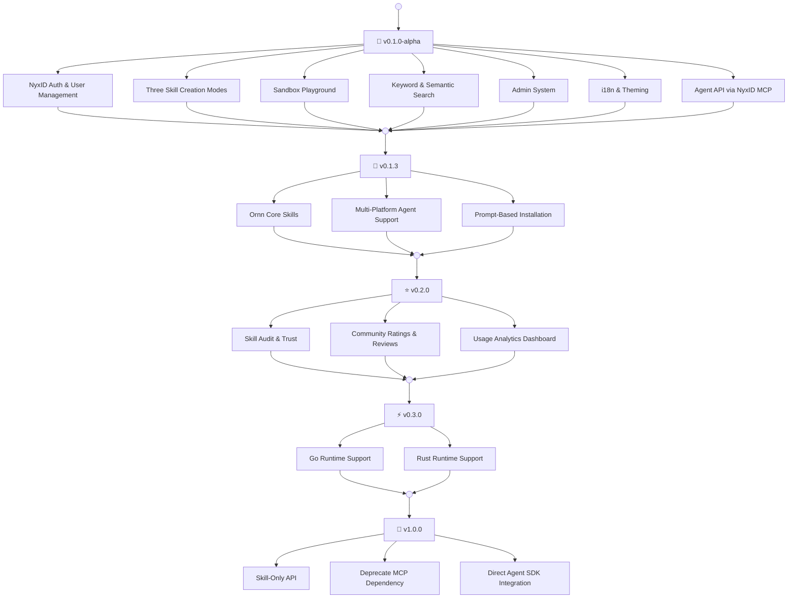

# Ornn Roadmap

---

## v0.1.0-alpha — Core Platform

The foundation release with all essential features:

- **NyxID Auth** — OAuth login, JWT verification, API key management
- **Three Creation Modes** — Guided, Free, and AI-Generative skill creation
- **Sandbox Playground** — Interactive skill testing with LLM context injection
- **Search** — Keyword and semantic search across the skill library
- **Admin System** — Category and tag management, activity logging
- **i18n & Theming** — English/Chinese with dark and light themes
- **Agent API** — Skill search, pull, upload, and build via NyxID MCP tools

## v0.1.3 — Core Skills & Multi-Platform Agent Support (Current)

Ornn Core Skills and prompt-based installation for multiple agent platforms:

- **Core Skills** — Three foundational skills (`ornn-search-and-run`, `ornn-upload`, `ornn-build`) that teach agents how to use the Ornn platform end-to-end
- **Multi-Platform Support** — Installation prompts for Claude Code, OpenAI Codex, Cursor, and Antigravity
- **Prompt-Based Installation** — Users paste a single prompt to install skills; no scripts needed
- **Documentation Overhaul** — Developer guide rewritten with real-world examples and workflow diagrams

## v0.2.0 — Skill Audit & Community

Build trust and community around the skill library:

- **Skill Audit** — Automated and manual review pipeline for published skills. Verify skill safety, quality, and compliance before they appear in public search results. Flag skills with unsafe patterns (shell injection, credential harvesting, excessive permissions)
- **Ratings & Reviews** — Users can rate and review skills, helping others discover high-quality capabilities
- **Usage Analytics** — Track skill usage patterns to surface popular and trending skills

## v0.3.0 — Sandbox Runtime Enhancement

Expand the sandbox playground with additional language runtimes:

- **Go** — Support for Go-based skill scripts
- **Rust** — Support for Rust-based skill scripts

## v1.0.0 — Skill-Only API (Future)

Move away from MCP as the primary integration layer and embrace direct, skill-native API integrations:

- **Skill-Only API** — A standalone REST/WebSocket API purpose-built for skill operations. Agents call Ornn directly without routing through an MCP proxy, eliminating MCP transport limitations (payload size constraints, base64 encoding overhead, connection management)
- **Deprecate MCP Dependency** — MCP remains supported as an optional transport but is no longer required. The Skill-Only API becomes the primary integration path
- **Direct Agent SDK Integration** — Lightweight SDKs (TypeScript, Python) that agents import directly to search, pull, execute, and upload skills with native language ergonomics
