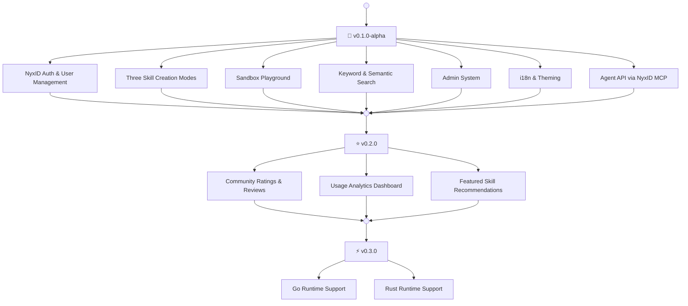

# Ornn Roadmap

---

## v0.1.0-alpha — Core Platform (Current)

The foundation release with all essential features:

- **NyxID Auth** — OAuth login, JWT verification, API key management
- **Three Creation Modes** — Guided, Free, and AI-Generative skill creation
- **Sandbox Playground** — Interactive skill testing with LLM context injection
- **Search** — Keyword and semantic search across the skill library
- **Admin System** — Category and tag management, activity logging
- **i18n & Theming** — English/Chinese with dark and light themes
- **Agent API** — Skill search, pull, upload, and build via NyxID MCP tools

## v0.2.0 — Skill Library Community

Enrich the skill library with community-driven features:

- **Ratings & Reviews** — Users can rate and review skills, helping others discover high-quality capabilities
- **Usage Analytics** — Track skill usage patterns to surface popular and trending skills
- **Featured Skills** — Curated recommendations to highlight the best skills on the platform

## v0.3.0 — Sandbox Runtime Enhancement

Expand the sandbox playground with additional language runtimes:

- **Go** — Support for Go-based skill scripts
- **Rust** — Support for Rust-based skill scripts
