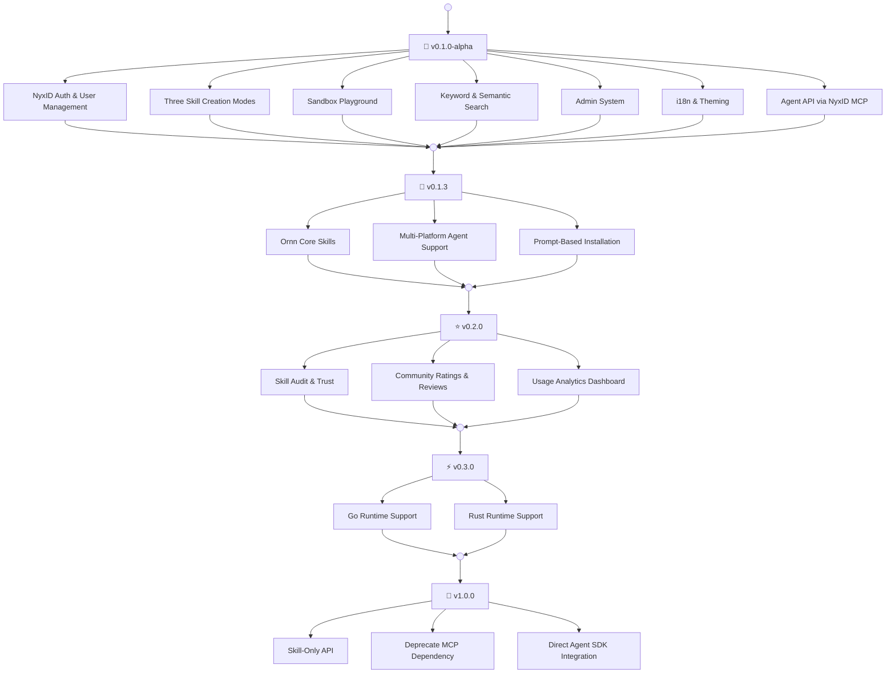

# Version Roadmap

---

<!-- RELEASES -->

---

## Planned Versions

### v0.2.0 — Skill Audit & Community

- **Skill Audit** — Automated safety and quality review for published skills before they appear in public search
- **Ratings & Reviews** — Rate and review skills to help others find high-quality capabilities
- **Usage Analytics** — Track usage patterns to surface popular and trending skills

### v0.3.0 — Sandbox Runtime Enhancement

- **Go** — Support for Go-based skill scripts
- **Rust** — Support for Rust-based skill scripts

### v1.0.0 — Skill-Only API (Future)

- **Skill-Only API** — Standalone REST/WebSocket API purpose-built for skill operations, eliminating MCP transport limitations
- **Deprecate MCP Dependency** — MCP remains optional; the Skill-Only API becomes the primary integration path
- **Direct Agent SDK** — Lightweight TypeScript and Python SDKs for native skill integration
