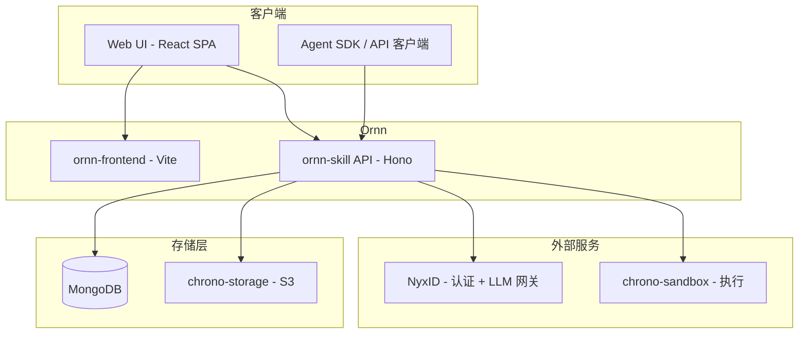

# Ornn 架构概览

## 系统架构

## 组件

### ornn-skill（后端 API）

基于 **Bun** 的 **Hono** 后端服务。处理：

- 技能 CRUD 操作
- 搜索（关键词 + 语义搜索）
- 技能生成（通过 NyxID LLM 网关的 AI 驱动）
- 试验场对话（流式 SSE）
- 管理操作（分类、标签）

### ornn-frontend（Web UI）

基于 **Vite** 的 React 19 SPA。功能：

- 技能浏览和搜索
- 三种创建模式（引导、自由、生成）
- 交互式试验场
- 管理面板

### 数据层

| 存储 | 用途 |
|------|------|
| **MongoDB** | 技能元数据、用户数据、分类、标签 |
| **chrono-storage** | 技能包文件（ZIP 存储） |
