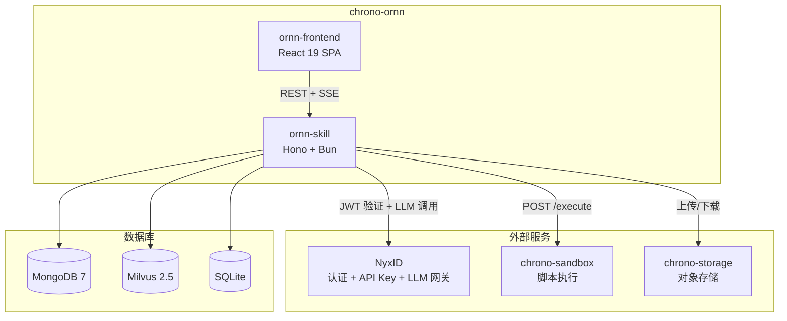
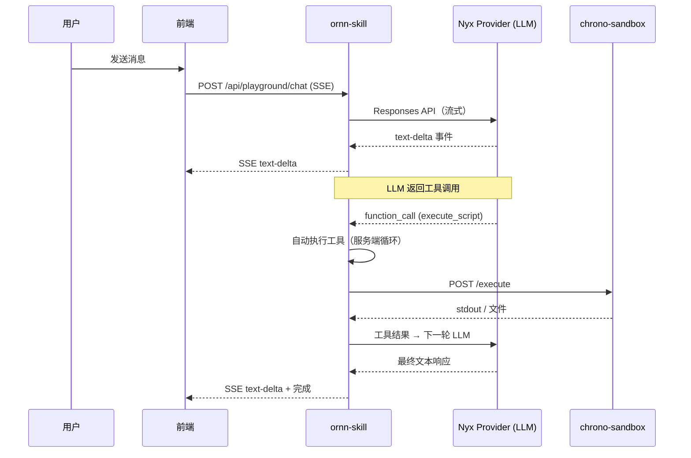
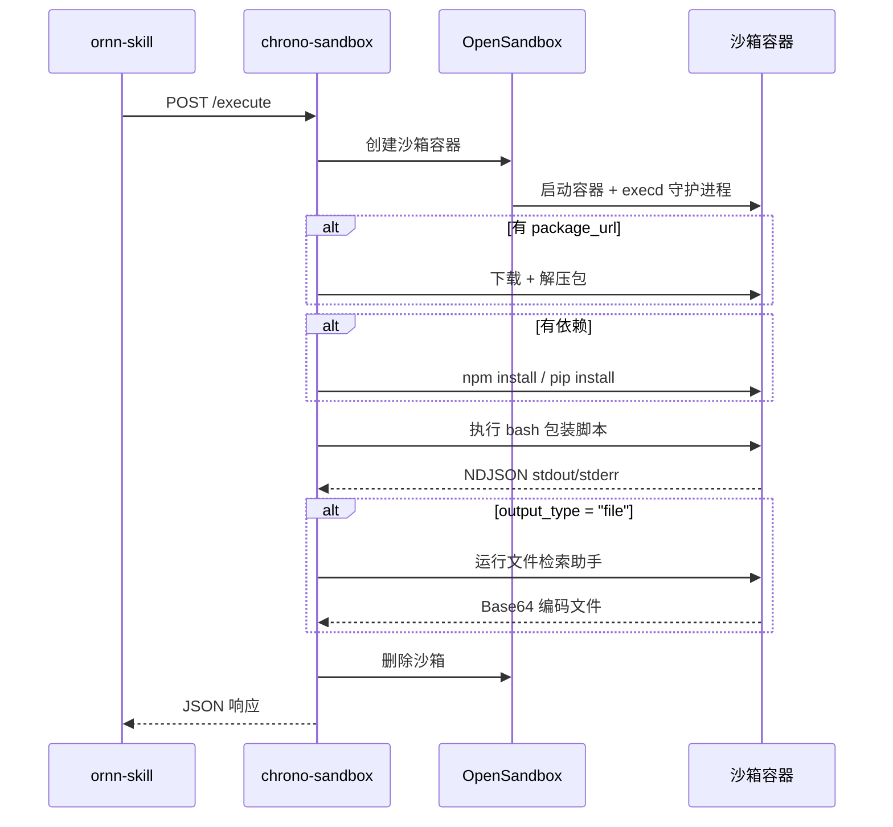

# 架构

## 1. 概述

Chrono-Ornn 是一个 AI 技能平台，用于创建、发布、搜索和执行 AI 技能。"技能"是一个打包的提示词 + 可选脚本，AI Agent 可以发现并运行。

平台由两个组件构成：

| 组件 | 角色 | 技术 |
|------|------|------|
| **ornn-skill** | 后端 API 服务器 | Hono, Bun, MongoDB, Milvus, SQLite |
| **ornn-frontend** | Web UI | React 19, Vite, Zustand, TanStack Query, Tailwind CSS 4 |



## 2. 外部依赖

| 服务 | 角色 |
|------|------|
| **NyxID** | OAuth 认证、JWT 令牌签发/验证、API Key 管理、LLM 网关（Nyx Provider） |
| **Nyx Provider** | NyxID 内的 LLM 网关 — 使用 Responses API 格式将模型请求路由到 OpenAI/Anthropic/Google 等 |
| **chrono-sandbox** | 沙箱化脚本执行（基于 OpenSandbox）。支持 Node.js 和 Python 运行时 |
| **chrono-storage** | S3 兼容的对象存储，用于技能包 |
| **MongoDB 7** | 技能元数据、分类、标签 |
| **Milvus 2.5** | 向量搜索，用于语义技能发现（SBERT 384维嵌入） |
| **SQLite** | Playground 凭据存储（AES-256-GCM 加密） |

## 3. ornn-skill（后端）

### 3.1 技术栈

| 技术 | 用途 |
|------|------|
| Hono | HTTP 框架 |
| Bun | 运行时 |
| MongoDB driver | 技能元数据 + 管理 CRUD |
| @zilliz/milvus2-sdk-node | 向量搜索 |
| jose | JWT 验证（NyxID 令牌） |
| JSZip | 技能包解析 |
| @xenova/transformers | SBERT 嵌入生成 |
| Pino | 结构化日志 |
| Zod | 请求/响应验证 |
| yaml | SKILL.md frontmatter 解析 |

### 3.2 源码结构

```
ornn-skill/src/
├── index.ts                    # 入口
├── bootstrap.ts                # 服务启动 + 依赖注入
├── middleware/
│   └── nyxidAuth.ts            # NyxID JWT 验证 + 权限检查
├── domains/
│   ├── skillCrud/              # 技能 CRUD（创建/读取/更新/删除）
│   ├── skillSearch/            # 关键词 + 语义搜索
│   ├── skillGeneration/        # AI 技能生成（SSE 流式）
│   ├── skillFormat/            # 格式规则 + 验证
│   ├── playground/             # 聊天 + 凭据管理
│   └── admin/                  # 分类 + 标签管理
├── clients/
│   ├── nyxLlmClient.ts        # Nyx Provider LLM 网关（Responses API）
│   ├── sandboxClient.ts       # chrono-sandbox HTTP 客户端
│   ├── storageClient.ts       # chrono-storage HTTP 客户端
│   └── authClient.ts          # NyxID 认证内省
├── infra/
│   ├── config.ts              # 环境变量加载
│   └── db/                    # MongoDB + Milvus 连接
└── shared/
    ├── schemas/               # Zod schemas（frontmatter 等）
    ├── types/                 # TypeScript 类型定义
    └── utils/                 # 工具函数（加密、哈希、嵌入）
```

### 3.3 API 路由

```
# 技能 CRUD
POST   /api/skills                        创建技能（ZIP 上传）
GET    /api/skills/:idOrName              按 GUID 或名称读取技能
PUT    /api/skills/:id                    更新技能
DELETE /api/skills/:id                    删除技能

# 技能搜索
GET    /api/skill-search                  关键词或语义搜索

# 技能格式
GET    /api/skill-format/rules            格式规则文档（公开）
POST   /api/skill-format/validate         验证 ZIP 包

# 技能生成
POST   /api/skills/generate               AI 生成（SSE 流）

# Playground
POST   /api/playground/chat               多轮对话（SSE 流）
GET    /api/playground/credentials         列出凭据
POST   /api/playground/credentials         创建凭据
PUT    /api/playground/credentials/:id     更新凭据
DELETE /api/playground/credentials/:id     删除凭据

# 管理
GET    /api/admin/categories              列出分类
POST   /api/admin/categories              创建分类
PUT    /api/admin/categories/:id          更新分类
DELETE /api/admin/categories/:id          删除分类
GET    /api/admin/tags                    列出标签
POST   /api/admin/tags                    创建标签
DELETE /api/admin/tags/:id               删除标签

# 健康检查
GET    /health                            存活检查
```

## 4. ornn-frontend（Web UI）

### 4.1 技术栈

| 技术 | 用途 |
|------|------|
| React 19 | UI 框架 |
| Vite 6 | 开发服务器 + 构建 |
| Zustand 5 | 状态管理 |
| TanStack Query 5 | 服务端状态 + 缓存 |
| React Router 7 | 路由 |
| Tailwind CSS 4 | 样式 |
| Framer Motion | 动画 |
| React Hook Form + Zod | 表单验证 |
| react-markdown | Markdown 渲染 |
| highlight.js | 代码语法高亮 |

### 4.2 页面

| 页面 | 路径 | 描述 |
|------|------|------|
| ExplorePage | `/` | 浏览和搜索公共技能 |
| SkillDetailPage | `/skills/:idOrName` | 查看技能详情 |
| CreateSkillGuidedPage | `/skills/new/guided` | 逐步创建向导 |
| CreateSkillFreePage | `/skills/new/free` | 自由编辑 SKILL.md |
| CreateSkillGenerativePage | `/skills/new/generate` | AI 驱动的技能生成 |
| UploadSkillPage | `/skills/new` | 上传 ZIP 包 |
| EditSkillPage | `/skills/:id/edit` | 编辑现有技能 |
| MySkillsPage | `/my-skills` | 用户的技能列表 |
| PlaygroundPage | `/playground` | 交互式技能测试 |
| SettingsPage | `/settings` | 用户设置 |
| AdminCategoriesPage | `/admin/categories` | 管理分类 |
| AdminTagsPage | `/admin/tags` | 管理标签 |

## 5. 技能格式

### 5.1 包结构

```
skill-name/
├── SKILL.md          # 必需 — frontmatter + 使用文档
├── scripts/          # 可选 — 可执行脚本
├── references/       # 可选 — 参考文档
└── assets/           # 可选 — 静态资源
```

### 5.2 SKILL.md Frontmatter

```yaml
---
name: "my-skill"
description: "这个技能做什么"
version: "1.0.0"
license: "MIT"
compatibility: "Claude 3.5+"

metadata:
  category: "runtime-based"      # plain | tool-based | runtime-based | mixed
  output-type: "text"            # text | file（runtime-based/mixed 必填）
  runtime:
    - "node"                     # node | python
  runtime-dependency:
    - "axios"
  runtime-env-var:
    - "API_KEY"
  tag:
    - "automation"
---
```

### 5.3 可用运行时

| 运行时 | 语言 | 脚本扩展名 | 包管理器 |
|--------|------|-----------|----------|
| `node` | JavaScript | `.js` / `.mjs` | npm |
| `python` | Python | `.py` | pip |

### 5.4 分类验证规则

| 分类 | 必填字段 | 禁止字段 |
|------|----------|----------|
| `plain` | — | runtime, toolList, runtimeDependency, runtimeEnvVar, outputType |
| `tool-based` | toolList（非空） | runtime, runtimeDependency, runtimeEnvVar, outputType |
| `runtime-based` | runtime（非空）, outputType | toolList |
| `mixed` | runtime + toolList（均非空）, outputType | — |

## 6. Playground

### 6.1 聊天流程



### 6.2 工具使用循环

Playground 使用**服务端工具使用循环**（最多 5 轮）。当 LLM 发出 `function_call` 时，后端自动执行并将结果反馈给 LLM 进行下一轮。不需要前端审批。

内置工具：

| 工具 | 描述 |
|------|------|
| `skill_search` | 按关键词或语义相似度搜索技能 |
| `execute_script` | 在 chrono-sandbox 中执行脚本，包含环境变量 + 依赖 |

### 6.3 凭据

用户提供的密钥（API Key、令牌）存储在 SQLite 中，使用 AES-256-GCM 加密。在沙箱执行时作为环境变量注入。

## 7. 沙箱集成

### 7.1 执行流程



### 7.2 输出类型

| output-type | 行为 |
|-------------|------|
| `text` | chrono-sandbox 返回 stdout 作为结果 |
| `file` | chrono-sandbox 检索生成的文件（base64），ornn-skill 上传到 chrono-storage 并返回预签名 URL |

## 8. LLM 集成（Nyx Provider）

所有 LLM 调用通过 NyxID 的 LLM 网关，使用 **Responses API** 格式：

- 端点：`/v1/responses`
- 消息字段：`input`（非 `messages`）
- 系统角色：`developer`（非 `system`）
- 最大令牌数：`max_output_tokens`（非 `max_tokens`）
- 用户令牌转发，用于按用户的提供者路由

模型前缀路由：

| 前缀 | 提供者 |
|------|--------|
| `gpt-*`, `o1-*`, `o3-*`, `o4-*` | OpenAI |
| `claude-*` | Anthropic |
| `gemini-*` | Google |
| `deepseek-*` | DeepSeek |

## 9. 数据存储

### 9.1 MongoDB 集合

| 集合 | 用途 |
|------|------|
| `skills` | 技能元数据（名称、描述、分类、元数据、storageKey、createdBy 等） |
| `categories` | 预定义技能分类 |
| `tags` | 预定义技能标签 |

### 9.2 Milvus

| 集合 | 用途 |
|------|------|
| `skill_embeddings` | 384 维 SBERT 向量，用于语义搜索（HNSW 索引，余弦相似度 >= 0.5） |

### 9.3 SQLite

| 表 | 用途 |
|----|------|
| `playground_credentials` | 加密用户凭据（每用户 AES-256-GCM） |

## 10. 环境变量

```bash
# 服务
PORT=3802
LOG_LEVEL=info
LOG_PRETTY=false

# NyxID
NYXID_JWKS_URL=https://nyxid.example.com/.well-known/jwks.json
NYXID_ISSUER=https://nyxid.example.com
NYXID_AUDIENCE=https://ornn.example.com
NYXID_INTROSPECTION_URL=https://nyxid.example.com/oauth/introspect
NYXID_CLIENT_ID=ornn-skill
NYXID_CLIENT_SECRET=<secret>

# Nyx Provider（LLM 网关）
NYX_LLM_GATEWAY_URL=https://nyxid.example.com/llm

# MongoDB
MONGODB_URI=mongodb://localhost:27017
MONGODB_DB=ornn

# Milvus
MILVUS_URI=http://localhost:19530
MILVUS_COLLECTION_NAME=skill_embeddings
SKILL_SEARCH_SIMILARITY_THRESHOLD=0.5

# chrono-storage
STORAGE_SERVICE_URL=http://chrono-storage:3805
STORAGE_BUCKET=ornn

# chrono-sandbox
SANDBOX_SERVICE_URL=http://chrono-sandbox:8080

# Playground
PLATFORM_MASTER_KEY=<十六进制编码32字节>
DATA_DIR=./data

# LLM 默认值
DEFAULT_LLM_MODEL=gpt-4o
LLM_MAX_OUTPUT_TOKENS=8192
LLM_TEMPERATURE=0.7
SSE_KEEP_ALIVE_INTERVAL_MS=15000

# 技能包
MAX_PACKAGE_SIZE_BYTES=52428800
```

## 11. Docker

所有 Docker 编排在 **chrono-docker-compose**（独立仓库）中。ornn 仓库不包含 docker-compose 文件。

每个组件有自己的 Dockerfile：
- `ornn-skill/Dockerfile`
- `ornn-frontend/Dockerfile`

基础设施服务（MongoDB、Milvus）和外部服务（chrono-sandbox、chrono-storage、NyxID）在 chrono-docker-compose 中管理。
