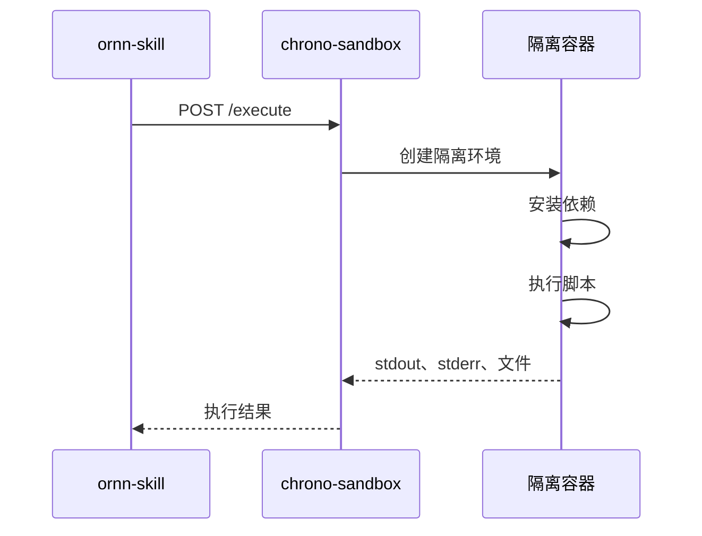

# chrono-sandbox

## 概述

chrono-sandbox 是一个隔离的执行环境，用于运行技能脚本。基于 OpenSandbox，支持 Node.js 和 Python 运行时。

## 支持的运行时

| 运行时 | 版本 | 包管理器 |
|--------|------|---------|
| Node.js | 20.x | npm |
| Python | 3.12 | pip |

## 执行流程



## API

### 执行脚本

```bash
POST /execute
Content-Type: application/json

{
  "runtime": "node",
  "entrypoint": "main.ts",
  "files": { "main.ts": "console.log('hello')" },
  "dependencies": ["axios@1.6.0"],
  "envVars": { "API_KEY": "..." },
  "timeout": 30000
}
```

### 响应

```json
{
  "exitCode": 0,
  "stdout": "hello\n",
  "stderr": "",
  "files": []
}
```

## 安全性

- 每次执行在完全隔离的容器中运行
- 网络访问受限
- 文件系统沙箱化
- CPU 和内存限制
- 执行超时防止无限循环
