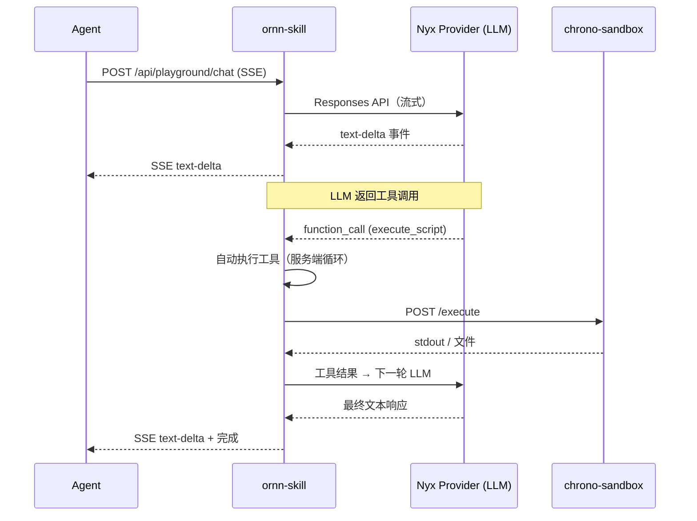

# 开发者指南

## 概述

Ornn 提供 REST API，AI Agent 可以用来发现和执行技能。Agent 通过 NyxID 认证（JWT 或 API Key）连接到 ornn-skill 的 API 端点。

## 认证

所有 API 请求需要 NyxID 令牌：

```
Authorization: Bearer <nyxid-jwt-或-api-key>
```

两种认证方式：
- **JWT** — 通过 NyxID OAuth 流程获取
- **API Key** — 在 NyxID 中生成（格式：`nyx_<64位十六进制>`），通过 NyxID 内省验证

## 核心 API 端点

### 搜索技能

```
GET /api/skill-search?query=<text>&mode=keyword&scope=public&page=1&pageSize=9
```

| 参数 | 类型 | 默认值 | 描述 |
|------|------|--------|------|
| `query` | string | — | 搜索文本（可选，最多 2000 字符） |
| `mode` | `keyword` \| `similarity` | `keyword` | 搜索模式 |
| `scope` | `public` \| `private` \| `mixed` | `private` | 搜索哪些技能 |
| `page` | number | 1 | 页码 |
| `pageSize` | number | 9 | 每页结果数（最多 100） |

响应：
```json
{
  "data": [
    {
      "guid": "uuid",
      "name": "skill-name",
      "description": "...",
      "metadata": { "category": "runtime-based", "outputType": "text" },
      "tags": ["tag1"],
      "presignedPackageUrl": "https://..."
    }
  ],
  "pagination": { "page": 1, "pageSize": 9, "total": 42 }
}
```

### 获取技能详情

```
GET /api/skills/:idOrName
```

返回完整的技能元数据，包括下载包的预签名 URL。

### 获取技能格式规则

```
GET /api/skill-format/rules
```

返回完整的技能格式规范（Markdown）。对于程序化创建技能的 Agent 很有用。

### 创建技能

```
POST /api/skills
Content-Type: application/zip
Body: <ZIP 字节>
```

上传技能包（ZIP）。包必须包含带正确 frontmatter 的有效 `SKILL.md`。

### 更新技能

```
PUT /api/skills/:id
Content-Type: application/zip
Body: <ZIP 字节>
```

### 删除技能

```
DELETE /api/skills/:id
```

### 切换可见性

```
PATCH /api/skills/:id/visibility
Content-Type: application/json

{ "isPublic": true }
```

## 执行技能

Agent 不直接调用 chrono-sandbox。而是使用 **Playground Chat** 端点，它处理完整的执行生命周期：

```
POST /api/playground/chat
Content-Type: application/json

{
  "model": "gpt-4o",
  "input": [
    { "role": "user", "content": "运行 chart-generator 技能..." }
  ]
}
```

响应：SSE 流，包含事件：
- `text-delta` — 流式文本块
- `tool-call` — 工具调用（skill_search, execute_script）
- `tool-result` — 工具执行结果
- `finish` — 响应结束

### 执行流程



Chat 端点使用服务端工具使用循环（最多 5 轮）。当 LLM 决定执行技能时，自动：
1. 从 chrono-storage 下载技能包
2. 将用户凭据作为环境变量注入
3. 安装依赖（npm/pip）
4. 在 chrono-sandbox 中执行脚本
5. 返回 stdout（文本）或生成的文件（上传到 chrono-storage 并返回预签名 URL）

## NyxID MCP 集成

NyxID 可以自动生成 MCP 服务器，将 Ornn 的 API 暴露为 MCP 工具。这让 Claude Code 和其他兼容 MCP 的 Agent 能够原生使用 Ornn 技能：

- `skill_search` — 搜索技能库
- `skill_pull` — 下载技能包
- `skill_upload` — 上传新技能
- `execute_script` — 在沙箱中运行技能脚本

设置方法：在 Agent 的 MCP 配置中配置 NyxID 生成的 MCP 服务器，并提供你的 NyxID API Key。

## 技能包格式参考

```
skill-name/               # 根文件夹（kebab-case）
├── SKILL.md              # 必需 — 精确大小写
├── scripts/              # 可选 — 可执行脚本
│   └── main.js           # node 用 .js/.mjs，python 用 .py
├── references/           # 可选 — 参考文档
└── assets/               # 可选 — 静态文件
```

### Frontmatter 字段

| 字段 | 必填 | 描述 |
|------|------|------|
| `name` | 是 | kebab-case，1-64 字符 |
| `description` | 是 | 1-1024 字符 |
| `version` | 否 | 语义版本号 |
| `license` | 否 | SPDX 标识符 |
| `compatibility` | 否 | 目标 AI 模型 |
| `metadata.category` | 是 | `plain`、`tool-based`、`runtime-based` 或 `mixed` |
| `metadata.output-type` | 条件 | `runtime-based`/`mixed` 必填：`text` 或 `file` |
| `metadata.runtime` | 条件 | `runtime-based`/`mixed` 必填：`["node"]` 或 `["python"]` |
| `metadata.runtime-dependency` | 否 | npm 包或 pip 包 |
| `metadata.runtime-env-var` | 否 | 必需的环境变量（UPPER_SNAKE_CASE） |
| `metadata.tool-list` | 条件 | `tool-based`/`mixed` 必填 |
| `metadata.tag` | 否 | 最多 10 个标签 |

## 速率限制与约束

| 约束 | 值 |
|------|-----|
| 最大包大小 | 50 MB |
| 最大搜索查询 | 2000 字符 |
| 每技能最大标签数 | 10 |
| 沙箱执行超时 | 默认 60 秒，最大 600 秒 |
| Playground 工具使用轮数 | 最多 5 轮 |
