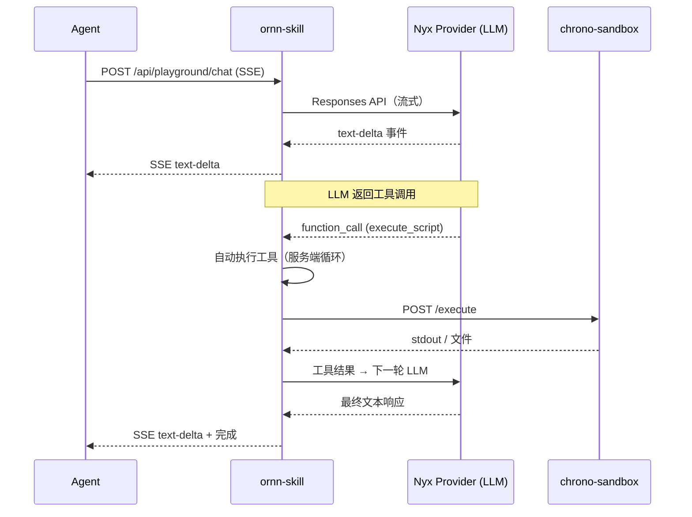
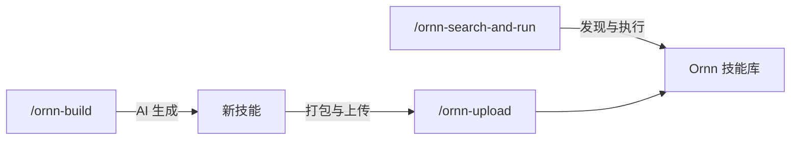

# 开发者指南

## 概述

Ornn 提供 REST API，AI Agent 可以用来发现和执行技能。Agent 通过 NyxID 认证（JWT 或 API Key）连接到 ornn-skill 的 API 端点。

## 认证

所有 API 请求需要 NyxID 令牌：

```
Authorization: Bearer <nyxid-jwt-或-api-key>
```

两种认证方式：
- **JWT** — 通过 NyxID OAuth 流程获取
- **API Key** — 在 NyxID 中生成（格式：`nyx_<64位十六进制>`），通过 NyxID 内省验证

## 核心 API 端点

### 搜索技能

```
GET /api/skill-search?query=<text>&mode=keyword&scope=public&page=1&pageSize=9
```

| 参数 | 类型 | 默认值 | 描述 |
|------|------|--------|------|
| `query` | string | — | 搜索文本（可选，最多 2000 字符） |
| `mode` | `keyword` \| `similarity` | `keyword` | 搜索模式 |
| `scope` | `public` \| `private` \| `mixed` | `private` | 搜索哪些技能 |
| `page` | number | 1 | 页码 |
| `pageSize` | number | 9 | 每页结果数（最多 100） |

响应：
```json
{
  "data": [
    {
      "guid": "uuid",
      "name": "skill-name",
      "description": "...",
      "metadata": { "category": "runtime-based", "outputType": "text" },
      "tags": ["tag1"],
      "presignedPackageUrl": "https://..."
    }
  ],
  "pagination": { "page": 1, "pageSize": 9, "total": 42 }
}
```

### 获取技能详情

```
GET /api/skills/:idOrName
```

返回完整的技能元数据，包括下载包的预签名 URL。

### 获取技能格式规则

```
GET /api/skill-format/rules
```

返回完整的技能格式规范（Markdown）。对于程序化创建技能的 Agent 很有用。

### 创建技能

```
POST /api/skills
Content-Type: application/zip
Body: <ZIP 字节>
```

上传技能包（ZIP）。包必须包含带正确 frontmatter 的有效 `SKILL.md`。

### 更新技能

```
PUT /api/skills/:id
Content-Type: application/zip
Body: <ZIP 字节>
```

### 删除技能

```
DELETE /api/skills/:id
```

### 切换可见性

```
PATCH /api/skills/:id/visibility
Content-Type: application/json

{ "isPublic": true }
```

## 执行技能

Agent 不直接调用 chrono-sandbox。而是使用 **Playground Chat** 端点，它处理完整的执行生命周期：

```
POST /api/playground/chat
Content-Type: application/json

{
  "model": "gpt-4o",
  "input": [
    { "role": "user", "content": "运行 chart-generator 技能..." }
  ]
}
```

响应：SSE 流，包含事件：
- `text-delta` — 流式文本块
- `tool-call` — 工具调用（skill_search, execute_script）
- `tool-result` — 工具执行结果
- `finish` — 响应结束

### 执行流程



Chat 端点使用服务端工具使用循环（最多 5 轮）。当 LLM 决定执行技能时，自动：
1. 从 chrono-storage 下载技能包
2. 将用户凭据作为环境变量注入
3. 安装依赖（npm/pip）
4. 在 chrono-sandbox 中执行脚本
5. 返回 stdout（文本）或生成的文件（上传到 chrono-storage 并返回预签名 URL）

## NyxID MCP 集成

NyxID 可以自动生成 MCP 服务器，将 Ornn 的 API 暴露为 MCP 工具。这让 Claude Code 和其他兼容 MCP 的 Agent 能够原生使用 Ornn 技能：

- `skill_search` — 搜索技能库
- `skill_pull` — 下载技能包
- `skill_upload` — 上传新技能
- `execute_script` — 在沙箱中运行技能脚本

设置方法：在 Agent 的 MCP 配置中配置 NyxID 生成的 MCP 服务器，并提供你的 NyxID API Key。

## Ornn 核心技能

Ornn 提供三个**核心技能**，教 AI Agent 如何与平台交互。它们位于 chrono-ornn 仓库的 [`ornn-core-skills/`](https://github.com/aevatarAI/chrono-ornn/tree/main/ornn-core-skills) 目录中。

### 安装

选择你的 Agent 平台对应的提示词，复制并粘贴给你的 Agent，它会自动从 GitHub 获取并安装技能。

> **前置条件：** 你的 Agent 必须连接 **NyxID MCP 服务器**。NyxID 提供核心技能所需的元工具（`nyx__discover_services`、`nyx__connect_service`、`nyx__call_tool`）来与 Ornn 交互。

#### Claude Code

技能存储在 `.claude/skills/`，安装后可作为斜杠命令使用（`/ornn-search-and-run` 等）。

```
从 https://github.com/aevatarAI/chrono-ornn/tree/main/ornn-core-skills 获取三个 Ornn 核心技能目录 — 每个目录（ornn-search-and-run、ornn-upload、ornn-build）包含一个 SKILL.md 文件。下载每个 SKILL.md 并在我项目的 .claude/skills/ 目录下创建对应的技能文件夹。最终结构应为：

.claude/skills/ornn-search-and-run/SKILL.md
.claude/skills/ornn-upload/SKILL.md
.claude/skills/ornn-build/SKILL.md
```

#### OpenAI Codex

技能作为 Agent 指令存储在 `AGENTS.md` 文件或 `codex/` 目录中。

```
从 https://github.com/aevatarAI/chrono-ornn/tree/main/ornn-core-skills 获取三个 Ornn 核心技能文件 — 每个目录（ornn-search-and-run、ornn-upload、ornn-build）包含一个 SKILL.md 文件。下载每个 SKILL.md 并保存到我项目的 codex/skills/ 目录。最终结构应为：

codex/skills/ornn-search-and-run/SKILL.md
codex/skills/ornn-upload/SKILL.md
codex/skills/ornn-build/SKILL.md

然后在我的 AGENTS.md 文件中添加对这些技能的引用（如果不存在则创建），以便 Codex 能够发现并调用它们。
```

#### Cursor

技能作为规则文件存储在 `.cursor/rules/` 中。

```
从 https://github.com/aevatarAI/chrono-ornn/tree/main/ornn-core-skills 获取三个 Ornn 核心技能文件 — 每个目录（ornn-search-and-run、ornn-upload、ornn-build）包含一个 SKILL.md 文件。下载每个 SKILL.md 并作为规则文件保存到我项目的 .cursor/rules/ 目录。最终结构应为：

.cursor/rules/ornn-search-and-run.md
.cursor/rules/ornn-upload.md
.cursor/rules/ornn-build.md
```

#### Antigravity

技能存储在 `.antigravity/skills/` 中。

```
从 https://github.com/aevatarAI/chrono-ornn/tree/main/ornn-core-skills 获取三个 Ornn 核心技能目录 — 每个目录（ornn-search-and-run、ornn-upload、ornn-build）包含一个 SKILL.md 文件。下载每个 SKILL.md 并在我项目的 .antigravity/skills/ 目录下创建对应的技能文件夹。最终结构应为：

.antigravity/skills/ornn-search-and-run/SKILL.md
.antigravity/skills/ornn-upload/SKILL.md
.antigravity/skills/ornn-build/SKILL.md
```

### 技能说明

#### `/ornn-search-and-run` — 发现并执行技能

搜索 Ornn 技能库，拉取技能内容，并执行 — 一条命令完成。

Agent 会按照以下流程操作：服务发现 → Ornn 连接 → 技能搜索（关键词或语义） → 拉取技能 JSON → 读取 `SKILL.md` 指令 → 执行。

**示例：**

```
/ornn-search-and-run 找一个韩语翻译的skill，翻译一下：你好，我是机器人

/ornn-search-and-run 搜索一个图片生成的skill，为我的创业公司生成一个logo

/ornn-search-and-run 找一个能总结网页的skill，然后总结 https://example.com
```

**示例执行过程：**

| 步骤 | Agent 操作 |
|------|-----------|
| 搜索 | 调用 `ornn__searchskills`，`mode: "semantic"` → 找到 `any-language-to-korean-translation` |
| 拉取 | 调用 `ornn__getskilljson` → 获取包含翻译指令的 `SKILL.md` |
| 执行 | 按照 `plain` 类型技能的指令操作 → 输出韩语翻译结果 |

#### `/ornn-build` — 用 AI 生成新技能

用自然语言描述你想要的技能，Ornn 的 AI 会生成完整的技能包（`SKILL.md` + 脚本）。

**示例：**

```
/ornn-build 写一个plain skill，用来检测文本中的敏感信息（API密钥、密码、PII等）

/ornn-build 创建一个Node.js skill，使用csv-parse库将CSV文件转换为JSON

/ornn-build 生成一个用来审查PR描述完整性的skill
```

**工作流程：**

1. Agent 调用 `ornn__generateskill`，传入你的描述
2. Ornn 流式返回生成的技能（SSE：`generation_start` → `token` → `generation_complete`）
3. Agent 从流中重建技能内容
4. 你审查输出，然后可以用 `/ornn-upload` 上传

支持**多轮迭代** — 如果第一次生成不理想，Agent 可以带着对话历史再次调用 `ornn__generateskill` 进行优化。

#### `/ornn-upload` — 打包并上传技能

将技能目录打包为 ZIP 并上传到 Ornn 注册中心。

**示例：**

```
/ornn-upload 上传我们刚刚生成的skill

/ornn-upload 打包并上传 my-custom-skill/ 到 Ornn
```

**关键细节：**

- ZIP 必须包含以技能名命名的**根文件夹**（如 `my-skill/SKILL.md`），不能是扁平文件
- `body` 参数是 base64 编码的 ZIP，通过 `ornn__uploadskill` 发送
- 如果同名技能已存在，则创建新版本
- 验证会检查 `SKILL.md` 的 frontmatter，除非设置 `skip_validation: true`

### 工作流概览

三个技能覆盖完整的 Ornn 生命周期：



## 技能包格式参考

```
skill-name/               # 根文件夹（kebab-case）
├── SKILL.md              # 必需 — 精确大小写
├── scripts/              # 可选 — 可执行脚本
│   └── main.js           # node 用 .js/.mjs，python 用 .py
├── references/           # 可选 — 参考文档
└── assets/               # 可选 — 静态文件
```

### Frontmatter 字段

| 字段 | 必填 | 描述 |
|------|------|------|
| `name` | 是 | kebab-case，1-64 字符 |
| `description` | 是 | 1-1024 字符 |
| `version` | 否 | 语义版本号 |
| `license` | 否 | SPDX 标识符 |
| `compatibility` | 否 | 目标 AI 模型 |
| `metadata.category` | 是 | `plain`、`tool-based`、`runtime-based` 或 `mixed` |
| `metadata.output-type` | 条件 | `runtime-based`/`mixed` 必填：`text` 或 `file` |
| `metadata.runtime` | 条件 | `runtime-based`/`mixed` 必填：`["node"]` 或 `["python"]` |
| `metadata.runtime-dependency` | 否 | npm 包或 pip 包 |
| `metadata.runtime-env-var` | 否 | 必需的环境变量（UPPER_SNAKE_CASE） |
| `metadata.tool-list` | 条件 | `tool-based`/`mixed` 必填 |
| `metadata.tag` | 否 | 最多 10 个标签 |

## 速率限制与约束

| 约束 | 值 |
|------|-----|
| 最大包大小 | 50 MB |
| 最大搜索查询 | 2000 字符 |
| 每技能最大标签数 | 10 |
| 沙箱执行超时 | 默认 60 秒，最大 600 秒 |
| Playground 工具使用轮数 | 最多 5 轮 |
