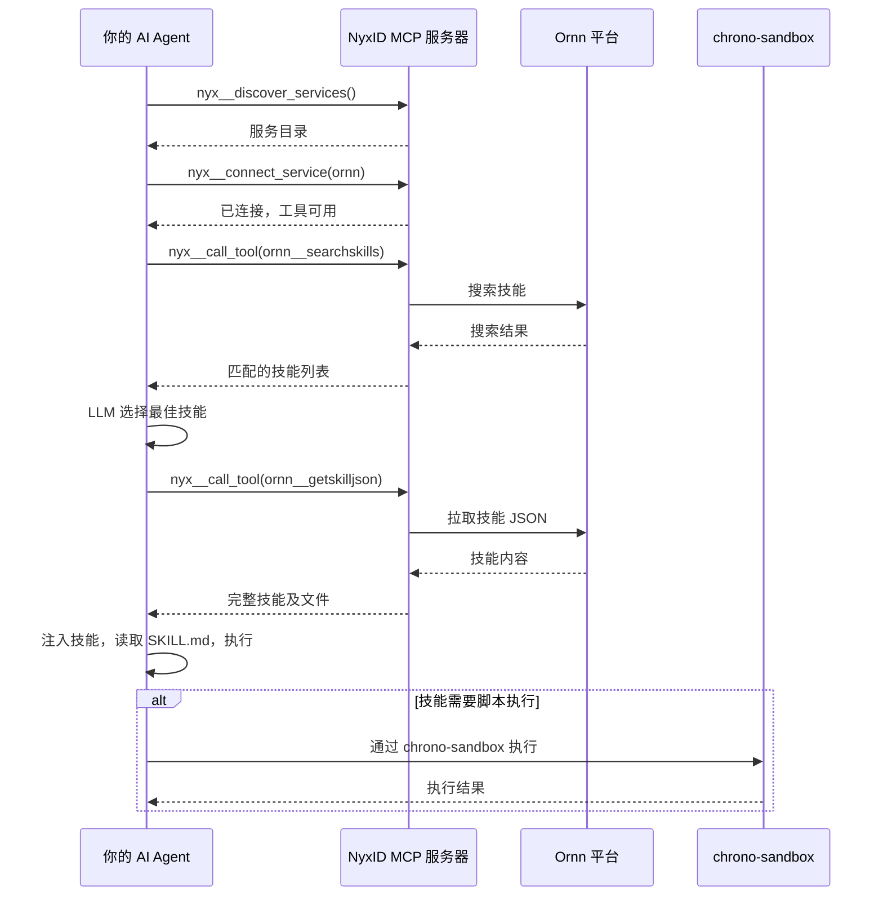

# NyxID MCP 集成

## 概述

NyxID MCP 是所有 Chrono 平台服务的中心网关。它负责认证、授权和服务路由 — 你的 AI Agent 通过调用 NyxID 元工具来发现、连接和调用 Ornn 服务。

## 前置条件

你的 AI Agent 必须连接到 **NyxID MCP 服务器**。连接后，Agent 可使用四个元工具：

| 工具 | 描述 |
|------|------|
| `nyx__discover_services` | 浏览 NyxID 实例上的可用服务 |
| `nyx__connect_service` | 连接服务以激活其工具 |
| `nyx__search_tools` | 按关键词搜索已连接的工具 |
| `nyx__call_tool` | 按名称执行任意已连接的工具 |

## 第 1 步 — 发现服务

调用 `nyx__discover_services` 查看 NyxID 提供的所有可用服务：

```json
// nyx__discover_services 返回结果（节选）
{
  "services": [
    {
      "service_id": "5a036016-b216-43e1-9c6f-f241f445607d",
      "name": "Ornn",
      "slug": "ornn",
      "category": "internal",
      "requires_credential": false
    },
    {
      "service_id": "b6dac2eb-0b36-4514-b600-aeb4cf870cd6",
      "name": "Chrono Sandbox Service",
      "slug": "chrono-sandbox-service",
      "category": "internal",
      "requires_credential": false
    }
  ],
  "count": 22
}
```

与 Ornn 技能执行相关的两个服务：

| 服务 | Slug | 用途 |
|------|------|------|
| **Ornn** | `ornn` | 技能搜索、拉取、上传和打造 |
| **Chrono Sandbox Service** | `chrono-sandbox-service` | 为运行时类型技能提供脚本执行 |

NyxID 还提供 LLM 服务商和第三方 API 的代理访问：

| 类别 | 服务 |
|------|------|
| **LLM 服务商** | OpenAI、Anthropic、Google AI、Mistral AI、Cohere、DeepSeek — 均通过 NyxID LLM 网关代理 |
| **第三方 API** | Twitter/X、Google、GitHub、Facebook、Discord、Spotify、Slack、Microsoft Graph、TikTok、Twitch、Reddit |
| **Chrono 内部服务** | Chrono LLM、Chrono Graph Service、Chrono Storage Service |

> **注意：** 标记为 `"requires_credential": true` 的服务需要用户在 NyxID 中绑定凭据。标记为 `"requires_credential": false` 的服务可直接使用。

## 第 2 步 — 连接 Ornn

调用 `nyx__connect_service`，传入 Ornn 的 `service_id`：

```json
{
  "service_id": "5a036016-b216-43e1-9c6f-f241f445607d"
}
```

响应：

```json
{
  "status": "connected",
  "service_name": "Ornn",
  "connected_at": "2026-03-16T08:21:46.590266623+00:00",
  "note": "Service tools are now available. Your tool list has been updated."
}
```

连接成功后，Ornn 工具出现在 Agent 的工具列表中。每个会话只需连接一次。

## 第 3 步 — 浏览 Ornn 工具

使用 `nyx__search_tools` 发现 Ornn 提供的工具：

```json
{ "query": "ornn" }
```

| 工具 | 描述 |
|------|------|
| `ornn__searchskills` | 通过关键词或语义相似度搜索技能 |
| `ornn__getskill` | 通过 GUID 或名称获取技能元数据（含包下载链接） |
| `ornn__getskilljson` | 以 JSON 格式获取技能包的完整文件内容（Agent 首选） |
| `ornn__uploadskill` | 上传 ZIP 打包的技能到注册中心 |
| `ornn__generateskill` | 通过自然语言 AI 生成技能（SSE 流式） |

## Ornn 工具参考

### `ornn__searchskills` — 搜索技能

| 参数 | 类型 | 默认值 | 描述 |
|------|------|--------|------|
| `query` | string | `""` | 自由文本搜索查询（最大 2000 字符），为空时返回所有技能 |
| `mode` | `"keyword"` \| `"semantic"` | `"keyword"` | keyword 为文本匹配（快速），semantic 为基于 LLM 的语义搜索 |
| `scope` | `"public"` \| `"private"` \| `"mixed"` | `"private"` | 可见性过滤 |
| `page` | integer | `1` | 页码（从 1 开始） |
| `pageSize` | integer | `9` | 每页结果数（1–100） |
| `model` | string | — | 语义模式使用的 LLM 模型（可选，使用平台默认） |

### `ornn__getskilljson` — 拉取技能内容

| 参数 | 类型 | 必填 | 描述 |
|------|------|------|------|
| `idOrName` | string | 是 | 技能 UUID 或唯一名称（如 `"web-summarizer"`） |

返回技能的名称、描述、元数据，以及 `files` 映射表（相对文件路径 → 完整文本内容）。Agent 首选接口。

### `ornn__getskill` — 获取技能元数据

| 参数 | 类型 | 必填 | 描述 |
|------|------|------|------|
| `idOrName` | string | 是 | 技能 UUID 或唯一名称 |

返回元数据、标签、可见性状态、时间戳，以及 `presignedPackageUrl`。

### `ornn__uploadskill` — 上传技能

| 参数 | 类型 | 必填 | 默认值 | 描述 |
|------|------|------|--------|------|
| `body` | string | 是 | — | Base64 编码的 ZIP 文件内容 |
| `skip_validation` | boolean | 否 | `false` | 跳过格式校验 |

上传的 ZIP 包必须包含根文件夹和有效的 `SKILL.md`。NyxID 会将 base64 body 解码为二进制后转发给 Ornn。

### `ornn__generateskill` — AI 技能生成

| 参数 | 类型 | 描述 |
|------|------|------|
| `prompt` | string | 单轮描述要生成的技能。与 `messages` 互斥 |
| `messages` | array | 多轮对话历史，用于迭代优化。与 `prompt` 互斥 |
| `model` | string | 使用的 LLM 模型（可选，使用平台默认） |

返回 SSE 流：`generation_start`、`token`（增量输出）、`generation_complete`（完整技能内容）、`validation_error`、`error`。

## 第 4 步 — 调用工具

所有 Ornn 工具通过 `nyx__call_tool` 调用。传入 `tool_name` 和 `arguments_json`（工具参数的 JSON 字符串）：

```json
{
  "tool_name": "ornn__searchskills",
  "arguments_json": "{\"query\": \"marketing image generation\", \"mode\": \"semantic\", \"scope\": \"mixed\"}"
}
```

响应示例：

```json
{
  "data": {
    "searchMode": "semantic",
    "searchScope": "mixed",
    "total": 1,
    "items": [
      {
        "guid": "5567ae54-55a8-4ca2-aa51-dd80d1958127",
        "name": "gemini-marketing-image-generation",
        "description": "Generate marketing images using the @google/genai library...",
        "tags": ["gemini", "image-generation", "marketing", "google-genai"]
      }
    ]
  },
  "error": null
}
```

## 完整工作流


