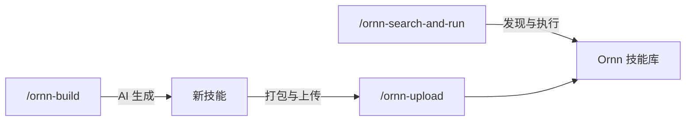

# AI Agent 开发者快速入门

## 概述

Ornn 平台提供的所有技能可供 AI Agent 直接使用。Ornn 平台暴露了 **skill search**（技能搜索）、**skill pull**（技能拉取）、**skill upload**（技能上传）和 **skill build**（技能打造）四个 Agent 服务，它们通过 NyxID 的远程 MCP 服务器将以上四种工具暴露给 AI Agent 进行调用。

> **最简单的方式：** 如果你的 Agent 已经装配好了 NyxID MCP，那么它将自动拥有 Ornn 平台中所有技能的能力！

## 安装 Ornn 核心技能

Ornn 提供三个**核心技能**，将整个工作流自动化 — 搜索、生成和上传 — 让你的 Agent 可以用简单的斜杠命令代替手动调用工具。

选择你的 Agent 平台对应的安装提示词，复制并粘贴给你的 Agent：

### Claude Code

```
从 https://github.com/aevatarAI/chrono-ornn/tree/main/ornn-core-skills 获取三个 Ornn 核心技能目录 — 每个目录（ornn-search-and-run、ornn-upload、ornn-build）包含一个 SKILL.md 文件。下载每个 SKILL.md 并在我项目的 .claude/skills/ 目录下创建对应的技能文件夹。最终结构应为：

.claude/skills/ornn-search-and-run/SKILL.md
.claude/skills/ornn-upload/SKILL.md
.claude/skills/ornn-build/SKILL.md
```

### OpenAI Codex

```
从 https://github.com/aevatarAI/chrono-ornn/tree/main/ornn-core-skills 获取三个 Ornn 核心技能文件 — 每个目录（ornn-search-and-run、ornn-upload、ornn-build）包含一个 SKILL.md 文件。下载每个 SKILL.md 并保存到我项目的 codex/skills/ 目录。最终结构应为：

codex/skills/ornn-search-and-run/SKILL.md
codex/skills/ornn-upload/SKILL.md
codex/skills/ornn-build/SKILL.md

然后在我的 AGENTS.md 文件中添加对这些技能的引用（如果不存在则创建），以便 Codex 能够发现并调用它们。
```

### Cursor

```
从 https://github.com/aevatarAI/chrono-ornn/tree/main/ornn-core-skills 获取三个 Ornn 核心技能文件 — 每个目录（ornn-search-and-run、ornn-upload、ornn-build）包含一个 SKILL.md 文件。下载每个 SKILL.md 并作为规则文件保存到我项目的 .cursor/rules/ 目录。最终结构应为：

.cursor/rules/ornn-search-and-run.md
.cursor/rules/ornn-upload.md
.cursor/rules/ornn-build.md
```

### Antigravity

```
从 https://github.com/aevatarAI/chrono-ornn/tree/main/ornn-core-skills 获取三个 Ornn 核心技能目录 — 每个目录（ornn-search-and-run、ornn-upload、ornn-build）包含一个 SKILL.md 文件。下载每个 SKILL.md 并在我项目的 .antigravity/skills/ 目录下创建对应的技能文件夹。最终结构应为：

.antigravity/skills/ornn-search-and-run/SKILL.md
.antigravity/skills/ornn-upload/SKILL.md
.antigravity/skills/ornn-build/SKILL.md
```

## 如何使用核心技能

安装后，三个技能可作为斜杠命令使用。每个技能会自动引导 Agent 完成整个 NyxID MCP 工作流（服务发现 → 连接 → 工具调用）。

> **前置条件：** 你的 Agent 必须连接到 NyxID MCP 服务器。详见 [NyxID MCP 集成](nyxid-mcp-integration) 了解设置细节和工具参考。

### `/ornn-search-and-run` — 发现并执行技能

搜索 Ornn 技能库，拉取技能并执行 — 一条命令完成。

**使用场景：**
- 你需要 Agent 本身不具备的能力（翻译、图片生成、数据转换等）
- 你想找到并运行社区技能，无需写任何代码
- 你需要快速完成一个由专业技能处理的一次性任务

**示例：**

```
/ornn-search-and-run 找一个韩语翻译的skill，翻译一下：你好，我是机器人
```

Agent 会：搜索 Ornn → 找到 `any-language-to-korean-translation` → 拉取 SKILL.md → 按照 plain skill 指令操作 → 输出：**안녕하세요, 저는 로봇입니다.**

```
/ornn-search-and-run 搜索一个图片生成的skill，为我的创业公司生成一个logo
```

```
/ornn-search-and-run 找一个能总结网页的skill，然后总结 https://example.com
```

**底层执行过程：**

| 步骤 | Agent 操作 |
|------|-----------|
| 1. 搜索 | 调用 `ornn__searchskills`，使用语义模式查找匹配的技能 |
| 2. 选择 | LLM 审查结果，选择最佳匹配 |
| 3. 拉取 | 调用 `ornn__getskilljson` 下载技能的 SKILL.md 和脚本 |
| 4. 执行 | 读取 SKILL.md 指令。`plain` 类型直接执行提示词。`runtime-based` 类型通过沙箱执行脚本 |

### `/ornn-build` — 用 AI 生成新技能

用自然语言描述你想要的技能，Ornn 的 AI 会生成完整的技能包。

**使用场景：**
- 你需要一个技能库中还不存在的可复用能力
- 你想把一段提示词或脚本打包成可分享的技能
- 你在为团队构建技能库

**示例：**

```
/ornn-build 写一个plain skill，用来检测文本中的敏感信息（API密钥、密码、PII等）
```

Agent 会：调用 `ornn__generateskill` → 流式返回生成的 SKILL.md → 展示结果供审查。

```
/ornn-build 创建一个Node.js skill，使用csv-parse库将CSV文件转换为JSON
```

```
/ornn-build 生成一个用来审查PR描述完整性的skill
```

**多轮迭代：** 如果第一次生成不理想，直接告诉 Agent 需要修改什么。它会带着对话历史再次调用 `ornn__generateskill` 进行优化。

### `/ornn-upload` — 打包并上传技能

将技能打包为 ZIP 并上传到 Ornn 注册中心，让其他人可以发现和使用。

**使用场景：**
- 用 `/ornn-build` 生成技能后，想要发布它
- 有一个本地技能目录想分享给团队
- 想要对已有技能进行版本更新（同名上传会创建新版本）

**示例：**

```
/ornn-upload 上传我们刚刚生成的skill
```

```
/ornn-upload 打包并上传 my-custom-skill/ 到 Ornn
```

**关键细节：**
- ZIP 必须包含以技能名命名的根文件夹（如 `my-skill/SKILL.md`）
- `body` 参数是 base64 编码的 ZIP
- 如果同名技能已存在，则创建新版本

### 端到端示例

以下是一个完整的会话，同时使用三个核心技能：

```
# 1. 搜索已有技能并使用
/ornn-search-and-run 找一个韩语翻译的skill，翻译一下：你好，我是Claude

# 2. 生成一个全新的技能
/ornn-build 写一个plain skill，用来检测文本中的敏感信息

# 3. 审查生成结果，然后上传
/ornn-upload 上传刚刚创建的 sensitive-information-detector skill
```



## 手动替代方案

当然，你永远都可以将一个技能包下载并手动装配到你的 AI Agent 中。但我们非常建议使用上面提到的核心技能方式，因为它可以大大减少手动工作并实现全自动化的技能检索与应用。

如需底层工具参考和 NyxID MCP 设置细节，请参阅 [NyxID MCP 集成](nyxid-mcp-integration)。
