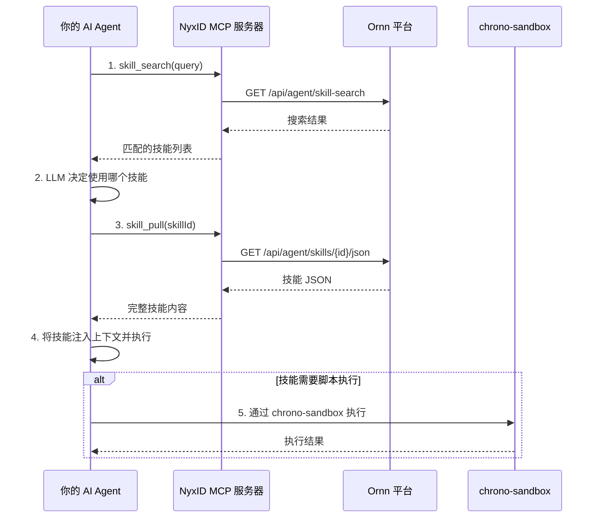

# AI Agent 开发者快速入门

## 概述

Ornn 平台提供的所有技能可供 AI Agent 直接使用。Ornn 平台暴露了 **skill search**（技能搜索）、**skill pull**（技能拉取）、**skill upload**（技能上传）和 **skill build**（技能打造）四个 Agent 服务，它们通过 NyxID 的远程 MCP 服务器将以上四种工具暴露给 AI Agent 进行调用。

> **最简单的方式：** 如果你的 Agent 已经装配好了 NyxID MCP，那么它将自动拥有 Ornn 平台中所有技能的能力！

## 推荐调用流程



### 第 1 步 — 搜索相关技能

根据具体需求，调用 **skill search** 通过语义查询相关技能。

```json
// skill_search 工具参数示例
{
  "query": "使用 AI 根据文字描述生成图片",
  "mode": "semantic",
  "scope": "public"
}
```

### 第 2 步 — 选择技能

根据 skill search 返回的结果（名称、描述、标签等），让你的 Agent LLM 决定要调用的技能。

### 第 3 步 — 拉取技能

将选中的技能 ID 或名称作为参数传入 **skill pull** 工具，拉取完整的技能 JSON。

```json
// skill_pull 工具参数示例
{
  "idOrName": "gemini-image-gen"
}
```

返回内容包含完整的技能包：SKILL.md 内容、脚本、参考文件和所有元数据。

### 第 4 步 — 注入并执行

将技能 JSON 注入你的 Agent 上下文，让 Agent 开始自动执行技能。

### 第 5 步 — 脚本执行

如果技能涉及代码或脚本执行，你有两种选择：

- **Agent 自主执行** — 如果你的 AI Agent 本身具备代码执行能力（例如自带沙箱运行时），可以直接执行脚本
- **chrono-sandbox** — 如果你的 Agent 没有代码执行能力，可以调用 Chrono 平台提供的沙箱服务来运行脚本并返回结果

## 手动替代方案

当然，你永远都可以将一个技能包下载并手动装配到你的 AI Agent 中。但我们非常建议使用上面提到的 NyxID MCP 方式，因为它可以大大减少手动工作并实现全自动化的技能检索与应用。
