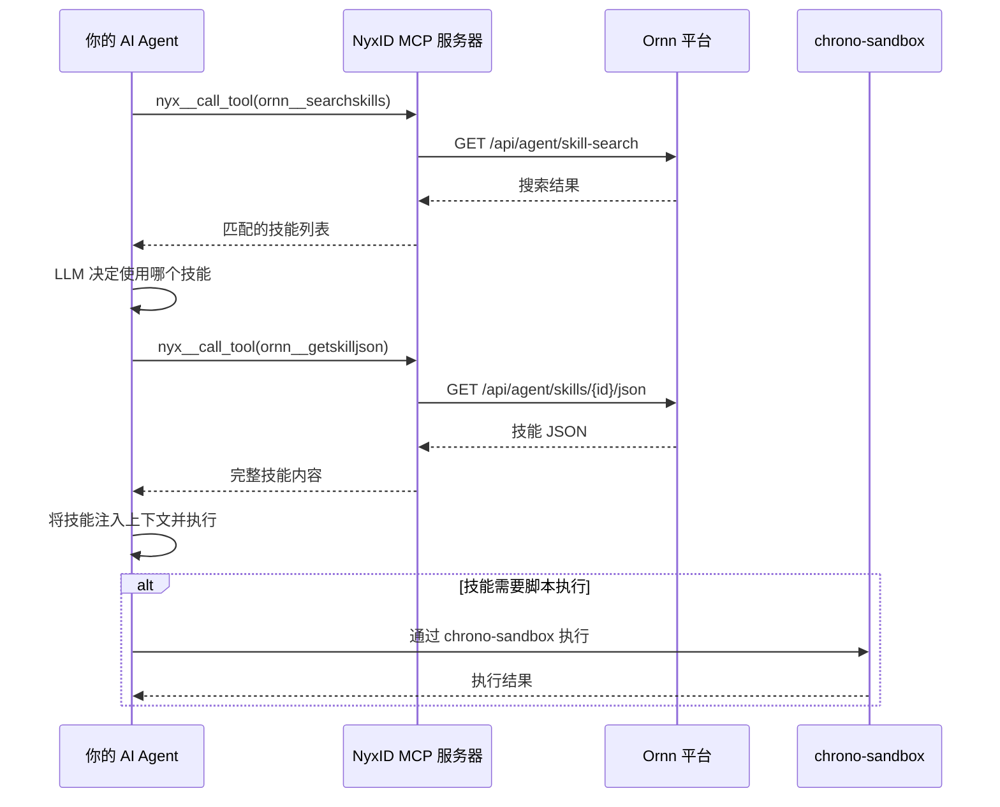

# AI Agent 开发者快速入门

## 概述

Ornn 平台提供的所有技能可供 AI Agent 直接使用。Ornn 平台暴露了 **skill search**（技能搜索）、**skill pull**（技能拉取）、**skill upload**（技能上传）和 **skill build**（技能打造）四个 Agent 服务，它们通过 NyxID 的远程 MCP 服务器将以上四种工具暴露给 AI Agent 进行调用。

> **最简单的方式：** 如果你的 Agent 已经装配好了 NyxID MCP，那么它将自动拥有 Ornn 平台中所有技能的能力！

## 前置条件

你的 AI Agent 必须连接到 **NyxID MCP 服务器**。NyxID MCP 是所有 Chrono 平台服务的中心网关 —— 它负责处理认证、授权和服务路由，你的 Agent 无需自行处理这些。

### 发现可用服务

在使用 Ornn 技能之前，你的 Agent 可以调用 `nyxid__discover_services` 来查看 NyxID 提供的所有可用服务。该工具返回完整的服务目录：

```json
// nyxid__discover_services 返回结果（节选）
{
  "services": [
    {
      "service_id": "5a036016-b216-43e1-9c6f-f241f445607d",
      "name": "Ornn",
      "slug": "ornn",
      "description": "",
      "category": "internal",
      "requires_credential": false
    },
    {
      "service_id": "b6dac2eb-0b36-4514-b600-aeb4cf870cd6",
      "name": "Chrono Sandbox Service",
      "slug": "chrono-sandbox-service",
      "description": "",
      "category": "internal",
      "requires_credential": false
    }
  ],
  "count": 22
}
```

与 Ornn 技能执行相关的两个服务：

| 服务 | Slug | 用途 |
|------|------|------|
| **Ornn** | `ornn` | 技能搜索、拉取、上传和打造 |
| **Chrono Sandbox Service** | `chrono-sandbox-service` | 为运行时类型技能提供脚本执行 |

NyxID 还提供了你的技能可能依赖的 LLM 服务商和第三方 API 的代理访问：

| 类别 | 服务 |
|------|------|
| **LLM 服务商** | OpenAI、Anthropic、Google AI、Mistral AI、Cohere、DeepSeek —— 均通过 NyxID LLM 网关代理 |
| **第三方 API** | Twitter/X、Google、GitHub、Facebook、Discord、Spotify、Slack、Microsoft Graph、TikTok、Twitch、Reddit |
| **Chrono 内部服务** | Chrono LLM、Chrono Graph Service、Chrono Storage Service |

> **注意：** 标记为 `"requires_credential": true` 的服务（例如 Chrono LLM）需要用户在 NyxID 中绑定自己的凭据。标记为 `"requires_credential": false` 的服务可通过 NyxID 代理直接使用。

### 连接服务

发现服务后，你的 Agent 需要先 **连接** 到目标服务，该服务的工具才会生效。调用 `nyxid__connect_service` 并传入发现结果中的 `service_id`：

```json
// nyxid__connect_service 工具参数
{
  "service_id": "5a036016-b216-43e1-9c6f-f241f445607d"
}
```

连接成功后，响应会确认连接状态并提示服务工具已可用：

```json
{
  "status": "connected",
  "service_name": "Ornn",
  "connected_at": "2026-03-16T08:21:46.590266623+00:00",
  "note": "Service tools are now available. Your tool list has been updated."
}
```

连接成功后，Ornn 的工具（`skill_search`、`skill_pull`、`skill_upload`、`skill_build`）会出现在你的 Agent 工具列表中，可以直接调用。其他服务也遵循相同的模式 —— 例如，如果需要脚本执行能力，连接 `chrono-sandbox-service` 即可。

> **提示：** 每个会话只需连接一次，连接在 MCP 会话结束前一直有效。

### 浏览可用工具

连接服务后，使用 `nyx__search_tools` 来发现该服务提供的工具。例如，搜索 Ornn 工具：

```json
// nyx__search_tools 工具参数
{
  "query": "ornn"
}
```

响应列出所有匹配的工具及其名称、描述和输入参数结构：

| 工具 | 描述 |
|------|------|
| `ornn__searchskills` | 通过关键词或语义相似度搜索技能 |
| `ornn__getskill` | 通过 GUID 或名称获取技能元数据（含包下载链接） |
| `ornn__getskilljson` | 以 JSON 格式获取技能包的完整文件内容（Agent 首选） |
| `ornn__uploadskill` | 上传 ZIP 打包的技能到注册中心 |
| `ornn__generateskill` | 通过自然语言 AI 生成技能（SSE 流式） |

每个工具结果都包含完整的 `inputSchema`，描述其参数。以下是各工具的详细说明：

#### `ornn__searchskills` — 搜索技能

| 参数 | 类型 | 默认值 | 描述 |
|------|------|--------|------|
| `query` | string | `""` | 自由文本搜索查询（最大 2000 字符），为空时返回所有技能 |
| `mode` | `"keyword"` \| `"semantic"` | `"keyword"` | keyword 为文本匹配（快速），semantic 为基于 LLM 的语义搜索 |
| `scope` | `"public"` \| `"private"` \| `"mixed"` | `"private"` | 可见性过滤 |
| `page` | integer | `1` | 页码（从 1 开始） |
| `pageSize` | integer | `9` | 每页结果数（1–100） |
| `model` | string | — | 语义模式使用的 LLM 模型（可选，使用平台默认） |

#### `ornn__getskilljson` — 拉取技能内容

| 参数 | 类型 | 必填 | 描述 |
|------|------|------|------|
| `idOrName` | string | 是 | 技能 UUID 或唯一名称（如 `"web-summarizer"`） |

返回技能的名称、描述、元数据，以及一个 `files` 映射表，其中每个键是相对文件路径，值是该文件的完整文本内容。这是 AI Agent 的首选接口。

#### `ornn__getskill` — 获取技能元数据

| 参数 | 类型 | 必填 | 描述 |
|------|------|------|------|
| `idOrName` | string | 是 | 技能 UUID 或唯一名称 |

返回元数据、标签、可见性状态、时间戳，以及用于下载原始 ZIP 包的 `presignedPackageUrl`。

#### `ornn__uploadskill` — 上传技能

| 参数 | 类型 | 默认值 | 描述 |
|------|------|--------|------|
| `skip_validation` | boolean | `false` | 跳过格式校验（适用于导入旧版包） |

上传一个 ZIP 包，包中至少包含一个带有效 YAML frontmatter 的 `skill.md`。如果该用户已有同名技能，将作为新版本更新。

#### `ornn__generateskill` — AI 技能生成

| 参数 | 类型 | 描述 |
|------|------|------|
| `prompt` | string | 单轮描述要生成的技能。与 `messages` 互斥 |
| `messages` | array | 多轮对话历史，用于迭代优化。与 `prompt` 互斥 |
| `model` | string | 使用的 LLM 模型（可选，使用平台默认） |

返回 SSE 流，包含事件：`generation_start`、`token`（增量输出）、`generation_complete`（完整技能内容）、`validation_error` 和 `error`。

### 使用 `nyx__call_tool` 调用工具

所有 Ornn 工具都通过 `nyx__call_tool` 调用。传入 `tool_name` 和 `arguments_json`（工具参数的 JSON 字符串）：

```json
// nyx__call_tool 参数 — 搜索技能
{
  "tool_name": "ornn__searchskills",
  "arguments_json": "{\"query\": \"marketing image generation\", \"mode\": \"semantic\", \"scope\": \"mixed\"}"
}
```

响应示例：

```json
{
  "data": {
    "searchMode": "semantic",
    "searchScope": "mixed",
    "total": 1,
    "totalPages": 1,
    "page": 1,
    "pageSize": 9,
    "items": [
      {
        "guid": "5567ae54-55a8-4ca2-aa51-dd80d1958127",
        "name": "gemini-marketing-image-generation",
        "description": "Generate marketing images using the @google/genai library with the gemini-3.1-flash-image-preview model, requiring only GEMINI_API_KEY.",
        "createdBy": "76fe9d91-1f1d-4234-9352-819a7c28f709",
        "createdByEmail": "shining.wang@aelf.io",
        "createdByDisplayName": "chronoai-shining",
        "createdOn": "2026-03-13T06:46:09.625Z",
        "updatedOn": "2026-03-13T09:21:53.051Z",
        "isPrivate": false,
        "tags": ["gemini", "image-generation", "marketing", "google-genai"]
      }
    ]
  },
  "error": null
}
```

每个搜索结果包含 `guid` 和 `name` —— 可以用其中任一个在下一步拉取完整技能内容。

## 推荐调用流程



### 第 1 步 — 搜索相关技能

使用 `nyx__call_tool` 调用 `ornn__searchskills`，传入语义或关键词查询：

```json
{
  "tool_name": "ornn__searchskills",
  "arguments_json": "{\"query\": \"使用 AI 根据文字描述生成图片\", \"mode\": \"semantic\", \"scope\": \"public\"}"
}
```

### 第 2 步 — 选择技能

根据 skill search 返回的结果（名称、描述、标签等），让你的 Agent LLM 决定要调用的技能。

### 第 3 步 — 拉取技能

使用 `nyx__call_tool` 调用 `ornn__getskilljson`，传入选中技能的 GUID 或名称：

```json
{
  "tool_name": "ornn__getskilljson",
  "arguments_json": "{\"idOrName\": \"gemini-marketing-image-generation\"}"
}
```

返回内容包含完整的技能包 —— 元数据、SKILL.md 和所有文件内容：

```json
{
  "data": {
    "name": "gemini-marketing-image-generation",
    "description": "Generate marketing images using the @google/genai library with the gemini-3.1-flash-image-preview model, requiring only GEMINI_API_KEY.",
    "metadata": {
      "category": "runtime-based",
      "outputType": "file",
      "runtimes": [
        {
          "runtime": "node",
          "dependencies": [{ "library": "@google/genai", "version": "*" }],
          "envs": [{ "var": "GEMINI_API_KEY", "description": "" }]
        }
      ],
      "tags": ["gemini", "image-generation", "marketing", "google-genai"]
    },
    "files": {
      "SKILL.md": "---\nname: gemini-marketing-image-generation\n...\n---\n\n# Gemini Marketing Image Generation\n\n## Overview\nGenerate a marketing image from a prompt using `@google/genai`...",
      "scripts/main.ts": "import { GoogleGenAI } from '@google/genai';\n\nconst apiKey = process.env.GEMINI_API_KEY;\n..."
    }
  },
  "error": null
}
```

响应中的关键字段：

| 字段 | 描述 |
|------|------|
| `metadata.category` | 技能类型：`plain`、`tool-based`、`runtime-based` 或 `mixed` |
| `metadata.outputType` | `text`（标准输出）或 `file`（生成文件） |
| `metadata.runtimes` | 运行时要求：语言、依赖包和所需环境变量 |
| `metadata.tags` | 技能标签，用于分类 |
| `files` | 相对文件路径到完整文本内容的映射表，始终包含 `SKILL.md` |

`files` 映射表为你的 Agent 提供了所需的一切 —— SKILL.md 包含使用说明，脚本文件可供执行。你的 Agent 可以阅读 SKILL.md 来理解如何使用该技能，并将脚本传给沙箱执行。

### 第 4 步 — 注入并执行

将技能 JSON 注入你的 Agent 上下文，让 Agent 开始自动执行技能。以上面的示例为例，你的 Agent 需要：

1. 阅读 `SKILL.md` 了解技能用途和所需环境变量（`GEMINI_API_KEY`）
2. 将 `scripts/main.ts` 适配沙箱环境（例如将 Bun 特有 API 替换为 Node.js 兼容写法）
3. 通过 chrono-sandbox 或 Agent 自身的运行时执行

### 第 5 步 — 脚本执行

如果技能涉及代码或脚本执行，你有两种选择：

- **Agent 自主执行** — 如果你的 AI Agent 本身具备代码执行能力（例如自带沙箱运行时），可以直接执行脚本
- **chrono-sandbox** — 如果你的 Agent 没有代码执行能力，可以调用 Chrono 平台提供的沙箱服务来运行脚本并返回结果

## 手动替代方案

当然，你永远都可以将一个技能包下载并手动装配到你的 AI Agent 中。但我们非常建议使用上面提到的 NyxID MCP 方式，因为它可以大大减少手动工作并实现全自动化的技能检索与应用。
