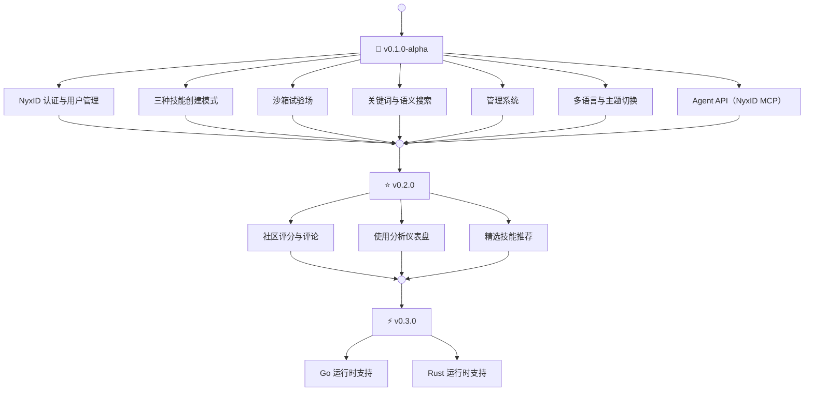

# Ornn 路线图

---

## v0.1.0-alpha — 核心平台（当前版本）

基础版本，包含所有核心功能：

- **NyxID 认证** — OAuth 登录、JWT 验证、API Key 管理
- **三种创建模式** — 引导式、自由上传、AI 生成式技能创建
- **沙箱试验场** — 交互式技能测试，支持 LLM 上下文注入
- **搜索** — 技能库的关键词与语义搜索
- **管理系统** — 分类和标签管理、活动日志
- **多语言与主题** — 中英文双语，深色与浅色主题
- **Agent API** — 通过 NyxID MCP 工具提供技能搜索、拉取、上传和打造

## v0.2.0 — 技能库社区功能

为技能库引入社区驱动的功能：

- **评分与评论** — 用户可以对技能进行评分和评论，帮助他人发现高质量的能力
- **使用分析** — 追踪技能使用情况，展示热门和趋势技能
- **精选技能推荐** — 精心策划的推荐，突出平台上的优质技能

## v0.3.0 — 沙箱运行时增强

扩展沙箱试验场，支持更多语言运行时：

- **Go** — 支持基于 Go 的技能脚本
- **Rust** — 支持基于 Rust 的技能脚本
