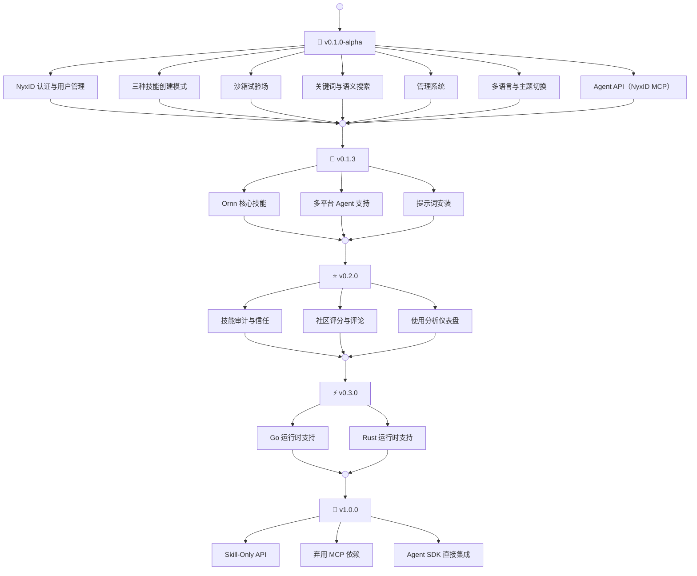

# Ornn 路线图

---

## v0.1.0-alpha — 核心平台

基础版本，包含所有核心功能：

- **NyxID 认证** — OAuth 登录、JWT 验证、API Key 管理
- **三种创建模式** — 引导式、自由上传、AI 生成式技能创建
- **沙箱试验场** — 交互式技能测试，支持 LLM 上下文注入
- **搜索** — 技能库的关键词与语义搜索
- **管理系统** — 分类和标签管理、活动日志
- **多语言与主题** — 中英文双语，深色与浅色主题
- **Agent API** — 通过 NyxID MCP 工具提供技能搜索、拉取、上传和打造

## v0.1.3 — 核心技能与多平台 Agent 支持（当前版本）

Ornn 核心技能与多平台提示词安装：

- **核心技能** — 三个基础技能（`ornn-search-and-run`、`ornn-upload`、`ornn-build`），教 Agent 如何端到端地使用 Ornn 平台
- **多平台支持** — 为 Claude Code、OpenAI Codex、Cursor、Antigravity 提供安装提示词
- **提示词安装** — 用户粘贴一段提示词即可安装技能，无需脚本
- **文档重写** — 开发者指南重写，包含真实使用示例和工作流图

## v0.2.0 — 技能审计与社区

建立技能库的信任机制和社区生态：

- **技能审计** — 已发布技能的自动和人工审查流水线。在技能进入公开搜索结果前，验证安全性、质量和合规性。标记存在不安全模式的技能（Shell 注入、凭据窃取、过度权限请求等）
- **评分与评论** — 用户可以对技能进行评分和评论，帮助他人发现高质量的能力
- **使用分析** — 追踪技能使用情况，展示热门和趋势技能

## v0.3.0 — 沙箱运行时增强

扩展沙箱试验场，支持更多语言运行时：

- **Go** — 支持基于 Go 的技能脚本
- **Rust** — 支持基于 Rust 的技能脚本

## v1.0.0 — Skill-Only API（未来规划）

逐步摆脱 MCP 作为主要集成层，拥抱直接的、以技能为核心的 API 集成：

- **Skill-Only API** — 专为技能操作构建的独立 REST/WebSocket API。Agent 直接调用 Ornn，无需通过 MCP 代理路由，消除 MCP 传输层的限制（payload 大小约束、base64 编码开销、连接管理等）
- **弃用 MCP 依赖** — MCP 作为可选传输层继续支持，但不再是必需的。Skill-Only API 成为主要集成路径
- **Agent SDK 直接集成** — 轻量级 SDK（TypeScript、Python），Agent 直接导入即可搜索、拉取、执行和上传技能，享受原生语言的开发体验
