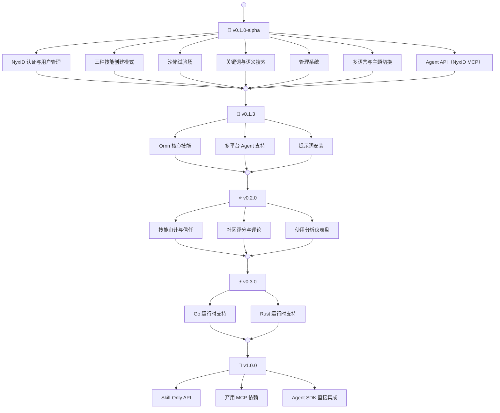

# 版本路线图

---

<!-- RELEASES -->

---

## 计划版本

### v0.2.0 — 技能审计与社区

- **技能审计** — 对已发布技能进行自动安全性和质量审查，确保通过审核后才出现在公开搜索中
- **评分与评论** — 对技能评分和评论，帮助他人发现高质量技能
- **使用分析** — 追踪使用情况，展示热门和趋势技能

### v0.3.0 — 沙箱运行时增强

- **Go** — 支持基于 Go 的技能脚本
- **Rust** — 支持基于 Rust 的技能脚本

### v1.0.0 — Skill-Only API（未来规划）

- **Skill-Only API** — 专为技能操作构建的独立 REST/WebSocket API，消除 MCP 传输层限制
- **弃用 MCP 依赖** — MCP 作为可选项保留，Skill-Only API 成为主要集成路径
- **Agent SDK 直接集成** — 轻量级 TypeScript 和 Python SDK，原生技能集成
